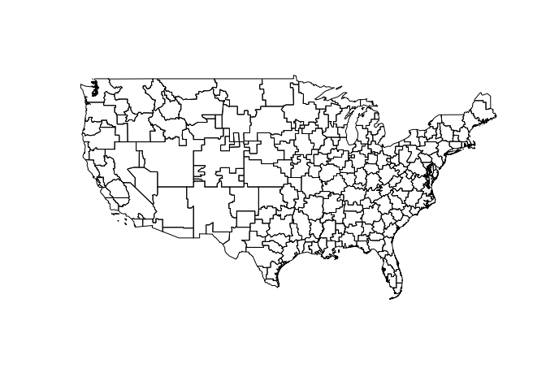
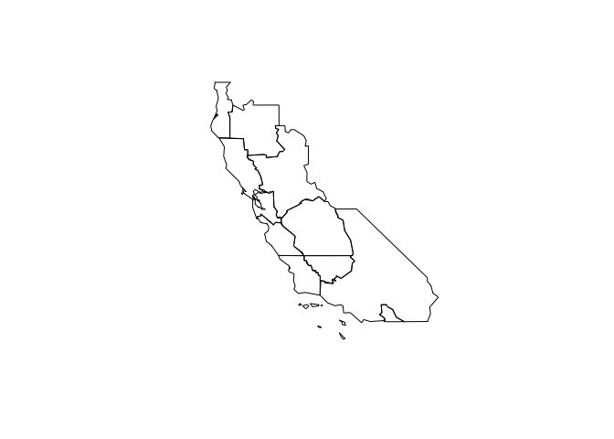
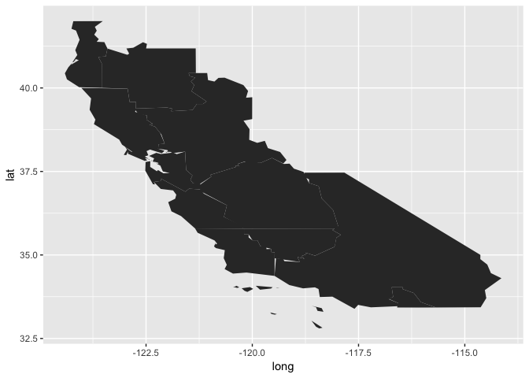
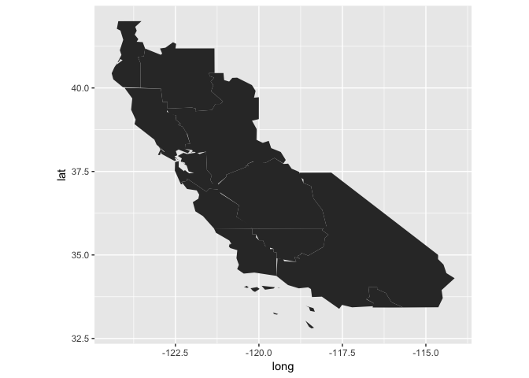
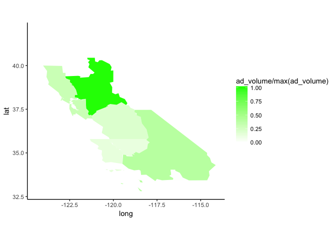
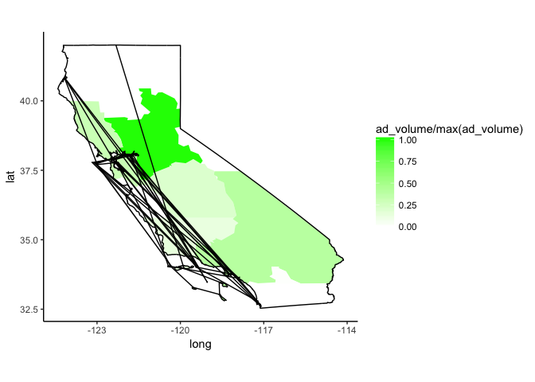
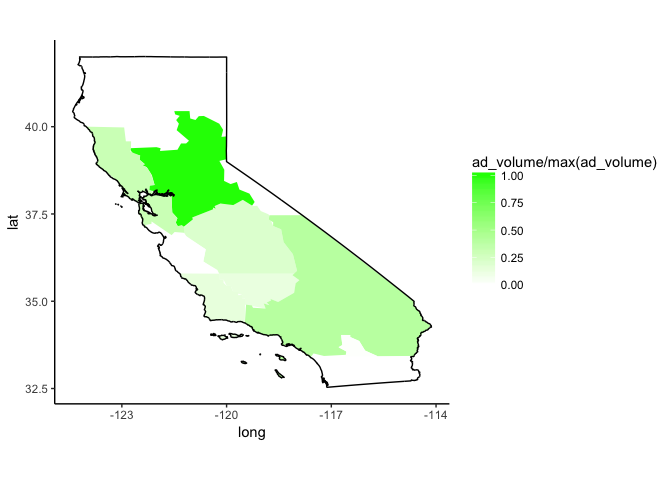
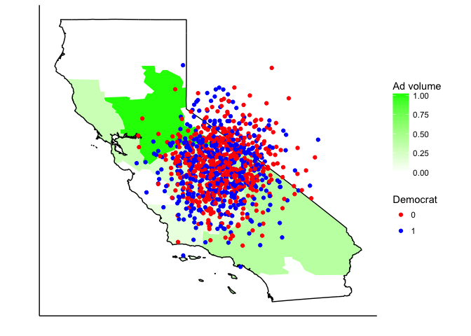
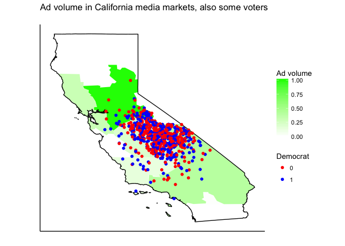

Tutorial objectives: \* Download, process, and plot some spatial data. \* Learn some elements of geospatial data design and visualization.

Before we begin, as a matter of good practice, I start every project by clearing my graphical and objective memory.

``` r
rm(list=ls())
graphics.off()
```

Here are the libraries we will be using.

``` r
library(rgdal)
```

    ## Loading required package: sp

    ## rgdal: version: 1.1-10, (SVN revision 622)
    ##  Geospatial Data Abstraction Library extensions to R successfully loaded
    ##  Loaded GDAL runtime: GDAL 1.11.4, released 2016/01/25
    ##  Path to GDAL shared files: /Library/Frameworks/R.framework/Versions/3.3/Resources/library/rgdal/gdal
    ##  Loaded PROJ.4 runtime: Rel. 4.9.1, 04 March 2015, [PJ_VERSION: 491]
    ##  Path to PROJ.4 shared files: /Library/Frameworks/R.framework/Versions/3.3/Resources/library/rgdal/proj
    ##  Linking to sp version: 1.2-3

``` r
library(ggplot2)
```

    ## Warning: package 'ggplot2' was built under R version 3.3.2

``` r
library(rgeos)
```

    ## rgeos version: 0.3-19, (SVN revision 524)
    ##  GEOS runtime version: 3.4.2-CAPI-1.8.2 r3921 
    ##  Linking to sp version: 1.2-3 
    ##  Polygon checking: TRUE

``` r
library(sp)
library(maptools)
```

    ## Checking rgeos availability: TRUE

``` r
library(dplyr)
```

    ## 
    ## Attaching package: 'dplyr'

    ## The following objects are masked from 'package:rgeos':
    ## 
    ##     intersect, setdiff, union

    ## The following objects are masked from 'package:stats':
    ## 
    ##     filter, lag

    ## The following objects are masked from 'package:base':
    ## 
    ##     intersect, setdiff, setequal, union

``` r
library(plyr)
```

    ## -------------------------------------------------------------------------

    ## You have loaded plyr after dplyr - this is likely to cause problems.
    ## If you need functions from both plyr and dplyr, please load plyr first, then dplyr:
    ## library(plyr); library(dplyr)

    ## -------------------------------------------------------------------------

    ## 
    ## Attaching package: 'plyr'

    ## The following objects are masked from 'package:dplyr':
    ## 
    ##     arrange, count, desc, failwith, id, mutate, rename, summarise,
    ##     summarize

Now, we'll download the data that we'll be using. We're going to use [a shapefile of DMA boundaries](https://github.com/johnlray/johnlray.github.io/raw/master/_posts/dma_boundary.zip), [a shapefile of California counties](https://github.com/johnlray/johnlray.github.io/raw/master/_posts/ca_boundary.zip), and [a voterfile snippet](https://github.com/johnlray/johnlray.github.io/raw/master/_posts/voters.csv).

``` r
download.file('https://github.com/johnlray/johnlray.github.io/raw/master/_posts/dma_boundary.zip', destfile = '~/Downloads/dma_boundary.zip')
unzip('~/Downloads/dma_boundary.zip', exdir = "~/Downloads/")
```

Lets try and find the data we'll be working with. \* Avoid opening the .dbf in a spreadsheet editor! \* In fact, do as little editing of the data outside of R as possible.

Now, lets talk about the structure of the data we will be using. The zip file that you downloaded using `download.file()` should be in your downloads folder. On Mac machines, this will almost always be `'~/Downloads.'` On Windows machines it will probably be something like `'C:\\Users\\Yourname\\Downloads\\'`.

``` r
list.files('~/Downloads/dma_boundary/')
```

    ## [1] "dma_boundary.dbf"    "dma_boundary.prj"    "dma_boundary.README"
    ## [4] "dma_boundary.shp"    "dma_boundary.shx"

The dataset we'll be working with is a shapefile of media markets in the United States. We might be interested in media markets because we might be interested in political advertisements. While we might be able to find the source of a media market shapefile online, maybe we can't find data about advertisements embedded within that shapefile. Lets say we go looking somewhere else and we find the data we want, but in a .csv and not in a shapefile.

``` r
ads = read.csv('https://github.com/johnlray/johnlray.github.io/raw/master/_posts/ad_volume.csv', stringsAsFactors = F)
head(ads)
```

    ##                             DMA_name ad_volume
    ## 1    Washington, DC (Hagerstown, MD)       222
    ## 2                      San Diego, CA       196
    ## 3               Monterey-Salinas, CA         0
    ## 4    Sacramento-Stockton-Modesto, CA       421
    ## 5                      Baltimore, MD        10
    ## 6 San Francisco-Oakland-San Jose, CA       128

``` r
str(ads)
```

    ## 'data.frame':    206 obs. of  2 variables:
    ##  $ DMA_name : chr  "Washington, DC (Hagerstown, MD)" "San Diego, CA" "Monterey-Salinas, CA" "Sacramento-Stockton-Modesto, CA" ...
    ##  $ ad_volume: int  222 196 0 421 10 128 0 5 411 59 ...

Load these files into R. Go into your Downloads folder and unzip `dma_boundary.zip`.

``` r
dma = readOGR(path.expand('~/Downloads/dma_boundary/'), layer = 'dma_boundary', stringsAsFactors = FALSE)
```

    ## OGR data source with driver: ESRI Shapefile 
    ## Source: "/Users/johnray/Downloads/dma_boundary/", layer: "dma_boundary"
    ## with 206 features
    ## It has 15 fields

Shapefiles by themselves are NOT dataframes. They are `s4` objects of class `SpatialPolygonsDataFrame`. In other words, they have their own wacky syntax. But they also have some standard practices associated with them. One is that an object in the `@data` slot inside of the `SpatialPolygonsDataFrame` object, which for us here is called `dma`, will contain the dataframe associating the variables of interest with each point or polygon.

``` r
head(dma@data)
```

    ##   DMA0 NAME                              DMA_1 EBITOUS0 LATITUDE0
    ## 0  511 <NA>    Washington, DC (Hagerstown, MD)      135  39.12768
    ## 1  825 <NA>                      San Diego, CA      115  33.01959
    ## 2  828 <NA>               Monterey-Salinas, CA      119  36.53761
    ## 3  862 <NA>    Sacramento-Stockton-Modesto, CA      102  38.79011
    ## 4  512 <NA>                      Baltimore, MD      113  38.97008
    ## 5  807 <NA> San Francisco-Oakland-San Jose, CA      142  38.44804
    ##   LONGITUDE0 DESCRIPTIO        FCC_TV_MAR FCC_TV_MA2 ORDER MARKETADS
    ## 0  -77.90368          - Washington, DC-MD        511     1      1056
    ## 1 -116.83833          -     San Diego, CA        825     2       474
    ## 2 -121.26583          -              <NA>          0     3        35
    ## 3 -120.99055          -    Sacramento, CA        862     4      1036
    ## 4  -76.50647          -     Baltimore, MD        512     5       800
    ## 5 -122.61556          - San Francisco, CA        807     6       309
    ##   MARKETADST CANDADSTHI GROUPADS GROUPADSTH
    ## 0          8          1      298          1
    ## 1          0          0       91          0
    ## 2          3          0       13          0
    ## 3          0          0      364          0
    ## 4          0          0       34          0
    ## 5          0          0       32          0

Recall that shapefiles also have coordinate reference systems associated with them. What is the coordinate reference system?

``` r
proj4string(dma)
```

    ## [1] "+proj=longlat +datum=NAD83 +no_defs +ellps=GRS80 +towgs84=0,0,0"

What does this mean? This simply tells your image renderer which projection system to draw the file on. This will be important as you start working with more kinds of spatial data. It isn't terribly important until you're plotting multiple different datasets at once, and want to make sure they project onto the same planet!

What does the data look like?

``` r
plot(dma)
```



That's a bit boring. In today's tutorial we will focus on plotting a specific subset of the data -- namely, the California media markets. We will then add some data to the shapefile that we will use in visualization. We will then plot another shapefile on top of it, and add some lat/lon data.

Lets say we want to focus on a partcular area. Say that area is California. How do we know which media markets overlap with the state of California? There are some ways we could find out (more on that below), but the easiest way is simply to know our data! Shapefiles are confusing to work with and so it is easy to use them without bothering to learn much about them. This is often a mistake.

``` r
dma = dma[dma@data$DMA_1 %in% c("San Diega, CA","Monterey-Salinas, CA","Sacramento-Stockton-Modesto, CA","San Francisco-Oakland-San Jose, CA","Yuma, AZ-El Centra, CA","Palm Springs, CA","Santa Barbara-Santa Maria-San Luis Obispo, CA","Bakersfield, CA","Los Angeles, CA", "Fresno-Visalia, CA", "Chico-Redding, CA", "Eureka, CA"),]

plot(dma)
```



Still kind of gross (and whats with the weird framing? Default `plot()` settings are bad!). Next, we will turn the shapefile into a data frame so that ggplot can read it. Standard practice is to start by creating a polygonID field.

``` r
dma@data$id = dma@data$DMA_1
```

Next, we use the fortify command from ggplot2. This allows us to merge the shapefile data frame to the lines dataframe and to join in the ads data that we want.

``` r
dma_f = fortify(dma, region = "id")
dma_f = join(dma_f, dma@data, by = "id")
dma_f = left_join(dma_f, ads, by = c("id" = "DMA_name"))
```

Alright, now we are ready to ggplot!

``` r
ggplot() + geom_polygon(data = dma_f, aes(x = long, y = lat, group = group)) 
```



Beautiful. First, lets straighten out the coordinates `using coord_equal()`.

``` r
ggplot() +
  geom_polygon(data = dma_f, aes(x = long, y = lat, group = group)) +
  coord_equal()
```



Then, lets add in some more aesthetic properties like a fill variable, and the colors for fill to take.

``` r
ggplot() +
  geom_polygon(data = dma_f, aes(x = long, y = lat, group = group, fill = ad_volume/max(ad_volume))) +
  scale_fill_continuous(low = 'white', high = 'green') +
  coord_equal() +
  theme_classic()
```



Looking a little better. Next, lets say we want to remind the reader that they're looking at the state of California, and so we want to include a boundary of California.

``` r
download.file('https://github.com/johnlray/johnlray.github.io/raw/master/_posts/ca_boundary.zip', destfile = '~/Downloads/ca_boundary.zip')
unzip('~/Downloads/ca_boundary.zip', exdir = '~/Downloads/ca_boundary')
ca = readOGR(path.expand('~/Downloads/ca_boundary/'), layer = 'ca_boundary')
```

    ## OGR data source with driver: ESRI Shapefile 
    ## Source: "/Users/johnray/Downloads/ca_boundary/", layer: "ca_boundary"
    ## with 1 features
    ## It has 13 fields

What is the CRS of this shapefile?

``` r
proj4string(ca)
```

    ## [1] "+proj=longlat +datum=WGS84 +no_defs +ellps=WGS84 +towgs84=0,0,0"

``` r
proj4string(dma)
```

    ## [1] "+proj=longlat +datum=NAD83 +no_defs +ellps=GRS80 +towgs84=0,0,0"

Uh oh, they look slightly different! To make sure they will always map properly, it is best practice to simply do something like this:

``` r
proj4string(ca) = proj4string(dma)
```

    ## Warning in ReplProj4string(obj, CRS(value)): A new CRS was assigned to an object with an existing CRS:
    ## +proj=longlat +datum=WGS84 +no_defs +ellps=WGS84 +towgs84=0,0,0
    ## without reprojecting.
    ## For reprojection, use function spTransform

Which simply sets the two coordinate reference systems equal to each other. The warning tells us that no re-projecting was actually done, but this will not always be the case! As usual, we will assign our state boundary an id field.

``` r
ca@data$id = rownames(ca@data)
ca_f = fortify(ca, region = 'id')
ca_f = join(ca_f, ca@data, by = 'id')

ggplot() +
  geom_polygon(data = dma_f, aes(x = long, y = lat, group = group, fill = ad_volume/max(ad_volume))) +
  geom_path(data = ca_f, aes(x = long, y = lat)) +
  scale_fill_continuous(low = 'white', high = 'green') +
  coord_equal() +
  theme_classic()
```



Oh no! What's going on here? How hideous! There are many possible errors stemming from the use of \`fortify,' especially if you have processed the shapefile data somewhere else like QGIS. Here, the fix is easy: If you're ggplotting a fortified object, always set group = group.

``` r
ggplot() +
geom_polygon(data = dma_f, aes(x = long, y = lat, group = group, fill = ad_volume/max(ad_volume))) +
  geom_path(data = ca_f, aes(x = long, y = lat, group = group)) +
  scale_fill_continuous(low = 'white', high = 'green') +
  coord_equal() +
  theme_classic()
```



Now say we want to add in some lat/lon data

``` r
voters = read.csv('https://github.com/johnlray/johnlray.github.io/raw/master/_posts/voters.csv', stringsAsFactors = F)
head(voters)
```

    ##         lon      lat democrat
    ## 1 -118.8600 37.17162        1
    ## 2 -118.5241 36.39109        0
    ## 3 -118.8975 36.39973        0
    ## 4 -118.9744 36.85155        0
    ## 5 -119.7480 37.38156        0
    ## 6 -118.6575 37.73158        0

Looks like some lat/lon data and then one variable of interest: `democrat,` which is probably a 0/1 for whether the respondent is a Democrat. Lets use that information to plot the data in a semi-intelligent fashion.

``` r
ggplot() +
  geom_polygon(data = dma_f, aes(x = long, y = lat, group = group, fill = ad_volume/max(ad_volume))) +
  geom_path(data = ca_f, aes(x = long, y = lat, group = group)) +
  geom_point(data = voters, aes(x = lon, y = lat, color = factor(democrat))) +
  scale_fill_continuous(low = 'white', high = 'green', name = "Ad volume") +
  scale_color_manual(values = c('red','blue'), name = "Democrat") +
  coord_equal() +
  theme_classic() +
  xlab("") +
  ylab("") +
  theme(axis.ticks = element_blank(), axis.text = element_blank())
```



Look at all those voters! Now say we only want the ones who are in California. We can use the highly useful `point.in.polygon function`, which returns a '1' if a point is contains inside of a given polygon, and a \`0' otherwise.

``` r
voters = voters[point.in.polygon(voters$lon, voters$lat, dma_f$long, dma_f$lat) == 1,]

ggplot() +
  geom_polygon(data = dma_f, aes(x = long, y = lat, group = group, fill = ad_volume/max(ad_volume))) +
  geom_path(data = ca_f, aes(x = long, y = lat, group = group)) +
  geom_point(data = voters, aes(x = lon, y = lat, color = factor(democrat))) +
  scale_fill_continuous(low = 'white', high = 'green', name = "Ad volume") +
  scale_color_manual(values = c('red','blue'), name = "Democrat") +
  coord_equal() +
  theme_classic() +
  xlab("") +
  ylab("") +
  theme(axis.ticks = element_blank(), axis.text = element_blank()) +
  ggtitle("Ad volume in California media markets, also some voters\n")
```



Not bad!
