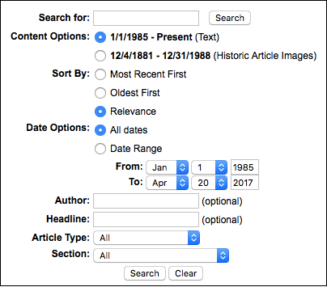
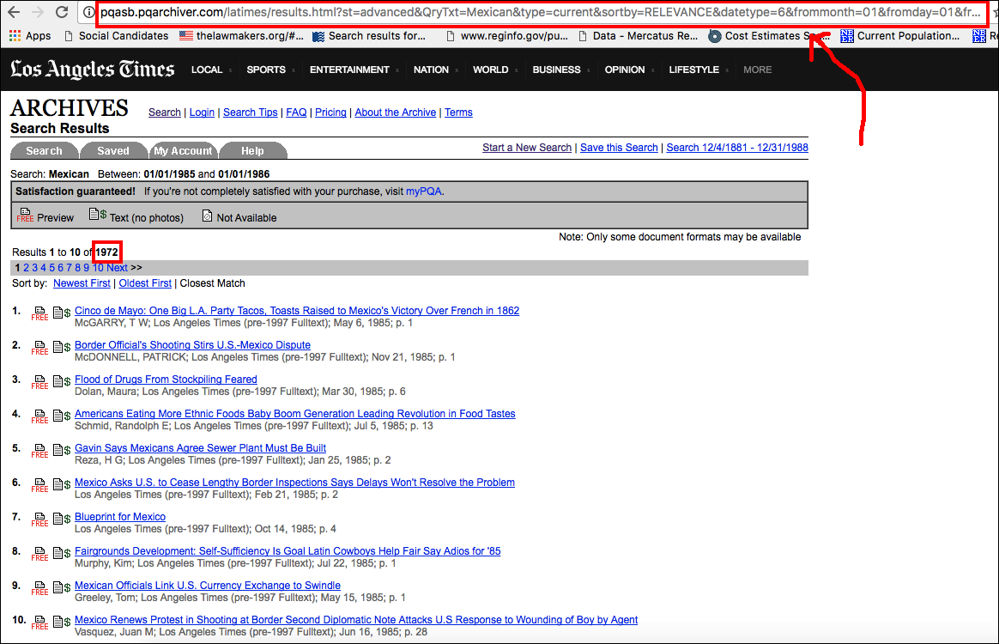
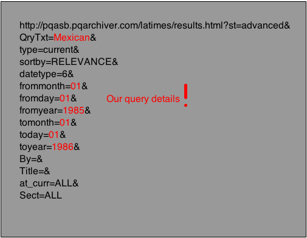

In this post, I will provide a brief tutorial on the most common form of what is commonly known as "web scraping." This form of web scraping involves the following operations:

- Querying a resource (visiting a website) in pursuit of a pre-defined result (the data you want)
- Locating the desired result (your data) in the structure of the resource (the page that gets returned)
- Formatting the results so they're useful for you as a data practitioner

Typically people think of "web scraping" as that first one and a little of the second one, but this is a mistake. Items two and three on that list usually take longer than the first, yet do not readily come to mind when we think of "web scraping." While practitioners have opted for some reason to refer to this practice as "scraping," all we are really doing is *querying* a website in the hopes of eliciting a *structured response,* or a response that we can structure into a dataset.

I call this the most common form of web scraping because usually our work amounts to slightly tweaking a URL over and over to find a slightly different result, capturing that result, and then formatting that result in a convenient way. Because many web resources use a stable and predictable URL structure to relate their data to users' browsers, mastering this process grants the user access to a huge array of different data sources that operate in a roughly similar fashion. In this example you will master neither the art nor the craft of acquiring data from a web resource, but you'll get some good practice and a broad overview of what your computer is actually doing when it is "scraping."

For this example, I will be querying the *Los Angeles Times* archives. I invite you to follow along with your own site of interest.

In this example, I am interested in just one type of data on the *Los Angeles Times* website, which is a count of the occurrences of an arbitrary search term in an arbitrary date range. In such cases there is often a temptation to simply assemble the desired dataset by hand, rather than to write code. That temptation amounts to lost time and effort because most scraping activities are very similar and, once the user becomes familiar with the practice, quite fast. Typically, scraping involves structuring a URL to return a page containing a desired result, and then popping that result into a dataframe. While every project is different in the minutia, the broad strokes are the same. As I will show here, the code involved is pretty straightforward and easily modified from project to project. Indeed, the hardest part is formatting the data, not getting the data.

Here is a screenshot of the front-end of the *Los Angeles Times* archives' website. On that page, users are invited to enter search terms into a box, to select a "content option," how to sort the results, a date range, and some optional article characteristics. What fun! For my present needs I will only be making use of the search box and the date range.



### Step 1: Figure out the site's URL structure

Before proceeding, it is important to stop and make sure you have a clear concept of the final dataset you want to build. Querying a lot of data can take a long time, and simply "scraping a webpage" can return a broad array of data. For this project, I am interested in producing counts of *LA Times* articles containing each of a list of search terms, and I want those counts to be aggregated by year. Thus, I will be manipulating the search box and the date range, and nothing else.


And here is the result when I press the "Search" button with this query.


Amidst all this data, the one result I want is plainly visible:


And, more importantly, the means of finding this data for lots and lots of query results in a short amount of time is plainly visible as well: The URL structure of the search.



Recall the contents of the search I submitted to start with, and then take a look at the full URL associated with the search: `http://pqasb.pqarchiver.com/latimes/results.html?st=advanced&QryTxt=Mexican&type=current&sortby=RELEVANCE&datetype=6&frommonth=01&fromday=01&fromyear=1985&tomonth=01&today=01&toyear=1986&By=&Title=&at_curr=ALL&Sect=ALL`. Lets stare at it for a minute and see if we can figure out how the resource is translating my manual search to a structured result.



We can clearly see from my masterful rendering in MS Paint that by manipulating the `QryTxt`, `frommonth`, `fromday`, `fromyear`, `tomonth`, `today`, and `toyear` parameters in the URL, we can fully recreate the search I entered manually. Lets try it. Change the URL we entered to something with a new date range and a new `QryTxt` term. If I change the `QryTxt` term to `Brazil,` for example, I see 746 articles written between January 1, 1985 and January 1, 1986 containing the phrase "Brazil" in the *LA Times* archives. In the example I used initially, I saw 3,201 articles containing the phrase "Mexico" written between 1985 and 1986.

This is the first crucial piece of information we will pass to our machines in a programmatic fashion, which our machines will in turn pass to the *LATimes* servers as a request for information, which the *LA Times* will return in the form of a web page from which we will cull some data. That data is the second part. That is, we need a way to tell our machines to look for that count of articles that pops up on the search result page.

### Step 2: Find your data on the pages associated with the URLs

To do so, we will install a browser add-on called [SelectorGadget](http://selectorgadget.com/), which works on all major browsers. Once you install and activate the extension, you will see a box to activate the add-on on your browser that looks like this:


I know often when working through a web tutorial one comes across a step towards its completion that strikes the reader as a bridge too far, but I promise, even though having SelectorGadget on your browser will permanently alter your browsing environment by introducing a new icon alongside your AdBlocker and your citation tracker, it is the easiest way to proceed. I promise.

Activating the SelectorGadget browser extension will produce a descriptor bar in the lower righthand side of your browser for the tab you had most recently selected prior to activating SelectorGadget. Upon proper application of the SelectorGadget browser extension, that bar will produce the name of the CSS selector corresponding to the part of the web resource that contains the data you seek. This "name" (selector, etc.) is the second piece of information you'll pass to `R` so that it knows which part of the web resource you want, with the first being the URL at which `R` may find the resource.

Once I've activated SelectorGadget I can find the data I want by simply clicking on the part of the web resource containing the data I want. Note that once the browser extension is active you can no longer interact with the page as you normally would. Instead, the cursor highlights pieces of the page. Each piece corresponds to the selector containing the data that you want.


For example, when I click on the selector that contains the number of results that I want, I get a selector called `.default`. I copy that result and, with that, we're ready to start writing some code.

Recall that the most common form of scraping is a three-step process -- querying a resource, locating its data, and formatting its data -- that requires the user to gather two pieces of information before writing any code -- The generic URL structure and the resource element or elements that contain the desired data. We're now finished with step two, and have both pieces of information we need. In step three, we put everything together using the `rvest` library to query our structured URL and to find the data we want, and then we format our results.

### Step 3: Store the result

Now that we're at the very end, let's write some code! Current best practice in `R` is to use the `rvest` library for scraping websites, and for good reason. `rvest` is easy as can be.

```{r}
library(rvest)
library(stringr)
```

The `rvest` library has a broad array of functions that help `R` interact with web-based data, and here I focus on a narrow subset of `rvest`'s uses. Because we'll be doing some formatting at the end, I will also load the `stringr` library. Recall that I want a count of occurrences of an arbitrary term in an arbitrary range, and I know that I will place both the desired terms and ranges in the URL of the *LA Times* search page to return the pages that I want. Lets stick with the example terms of "Mexico" and "Brazil," and let's say I want results for the years 1985, 1986, and 1987. I next create containers for the search terms and the search years, because I know I will be varying those within the URL structure I'll be querying.

```{r}
terms <- c('Mexico', 'Brazil')
years <- c(1985, 1986, 1987)
```

Lets start with the first term and the first year which, as we recall, will be inserted at specific places in the URL to return the desired search result.

```{r}
url <- paste0('http://pqasb.pqarchiver.com/latimes/results.html?st=advanced&QryTxt=',terms[1],'&type=current&sortby=RELEVANCE&datetype=6&frommonth=01&fromday=01&fromyear=',years[1],'&tomonth=01&today=01&toyear=',years[2],'&By=&Title=&at_curr=ALL&Sect=ALL')
```

As the date range calls for both a start point and an end point, I include two of the `years` elements so that the search knows when to stop. Then, to acquire the actual web resource associated with the url that I've stored in the `url` variable, I use the `read_html()` function, which takes a character string URL as an input and returns the web resource associated with that URL.

```{r}
site <- read_html(url)
```

And then, once `R` has the website that we want, I tell it which part of the site to go look for using the CSS selector found using SelectorGadget. There are several ways to do thise, but the `html_nodes()` function is typically easiest. The `html_nodes()` function takes a web resource and a selector as an argument, with CSS being the default language associated with the selector.

```{r}
sel <- html_nodes(site, ".default")
sel
```

While we're getting closer, we're not quite there yet as our result looks like gobbledygoop. This is because `html_nodes()` returns the html associated with a selector, which does not automatically mean that the result is human-legible text. To reduce the result to text, typically you'll use either `html_table()` which translates a tabular result to an `R` data frame, or `html_text()`, which translates a text result to human-readable text. For my project, I'll be using `html_text()`.

```{r}
html_text(sel)
```

And there, in the fifth element, we see the count of the results I want. To get that single number that I want ("3201"), I will want to store the results so far as a vector, subset to only the element of the vector containing the results count, shave off every part of that element to only include that number, and then store that number as a numeric value. Perhaps now you see what I mean when I point out the data formatting step often takes longer than iguring out the URL of the site to scrape itself!

This part of the process varies much more from project to project, and so I provide a brief overview. First, I'll store my `html_text()` result as a new variable. Then, using the `grep()` function, I will subset that variable, which is a character vector, to only the elements of that vector that contain a phrase I know will be associated with the count of search results, namely, the phrase "Result". Looking at the character element containing the overall count of results I see that the number of total results, as with many other similar search engines, is reported at the end of a string constructed something like "Result 1 to 10 of 3201". If I tell `R` to take everything after the string " of ", I know I will get the result I seek.

To do so, I will split the vector element at the string " of " and take the part *after* the split, which will be the last element of the result. To get the last part of a strsplit, one can use the `tail()` function exactly as one would to get the last `x` elements of a data frame or something like that. Specifically, I want the "last 1" result, or the end of the string that I'm splitting.

To format the result, then, I will `grep()` the text down to the element containing the string "Result", then `strsplit()` that element at the string " of ", then `unlist()` the result so I can take the last `tail()` element of the result, which I will store `as.numeric()`. That last one is only sensible if you prefer to store a numeric result.

```{r}
res <- sel %>%
  html_text()

res <- res[grep('Result', res)] %>%
  strsplit(" of ") %>%
  unlist() %>%
  tail(1) %>%
  as.numeric()

res
```

Finally, I prefer to wrap all this work in a function because I plan to be doing it over and over again. Most likely, this is of little use to the reader, who has their own project to work on involving a URL that will take a wholly different set of parameters. The general logic of wrapping this work in a function, however, is that doing so allows us to easily pass a long range of dates and terms to the URL to draw results from.

```{r}
LA_times_query <- function(term, startyear, endyear){
  require(rvest)
  require(stringr)
  
  url <- paste0('http://pqasb.pqarchiver.com/latimes/results.html?st=advanced&QryTxt=',term,'&type=current&sortby=RELEVANCE&datetype=6&frommonth=01&fromday=01&fromyear=',startyear,'&tomonth=01&today=01&toyear=',endyear,'&By=&Title=&at_curr=ALL&Sect=ALL')
  
  site <- read_html(url)
  
  res <- site %>%
    html_nodes(".default") %>%
    html_text()
  
  res <- res[grep('Result', res)] %>%
    strsplit(" of ") %>%
    unlist() %>%
    tail(1) %>%
    as.numeric()
  
  return(res)
}
```

And with a dataframe of search terms, our scraping is good to go.

```{r}
searchdat <- data.frame(
  terms = c(rep('Mexico', 3), rep('Brazil', 3)),
  startyears = rep(1985:1987, 2),
  endyears = rep(1986:1988, 2)
)

for(i in 1:nrow(searchdat)){
  print(LA_times_query(searchdat$terms[i],
                       searchdat$startyears[i],
                       searchdat$endyears[i])
        )
}
```