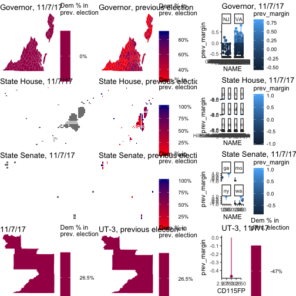

On this page, I am tracking election results for the State House, State Senate/State Assembly, Governor, and Congressional races going on today.

### Tonight's results

The races I will be watching tonight include

* Virginia governorship and State House
* New Jersey governorship and General Assembly
* Georgia State House 4, 26, 42, 56, 60, 89, 117, and 119
* Georgia State Senate 6 and 39
* Maine State House 56
* Massachusetts 1st Berkshire and 3rd Essex (State House)
* Michigan State House 1 and 109
* Missouri State House 23 and 151
* Missouri State Senate 8
* New Hampshire Hillsborough 15 (State House)
* New York State Assembly 27 and 71
* New York State Senate 26
* South Carolina State House 113
* Washington State House 7, 31, and 48
* Washington State Senate 7, 37, 45, and 48

The first column of plots include the Governors' races. The second column of plots includes the lower house races, with lower house seats across the US drawn as equally-sized pixels. The third column includes upper house races.

I will be tracking, but not plotting, the Utah 3rd Congressional district race as well. I could not devise an optimal visual display that included UT-3, but I will note the results.

### Results from these districts' previous elections

### Tonight's Dem - Rep margins

### These districts' previous Dem - Rep margins

Here is the data that goes into these graphs.

|State |County           | Previous margin| Tonights margin|
|:-----|:----------------|---------------:|---------------:|
|NJ    |Atlantic         |      -0.2648852|              NA|
|NJ    |Bergen           |      -0.2183007|              NA|
|NJ    |Burlington       |      -0.2636683|              NA|
|NJ    |Camden           |      -0.1119725|              NA|
|NJ    |Cape May         |      -0.4557209|              NA|
|NJ    |Cumberland       |      -0.1549305|              NA|
|NJ    |Essex            |       0.2507773|              NA|
|NJ    |Gloucester       |      -0.3034749|              NA|
|NJ    |Hudson           |       0.1127531|              NA|
|NJ    |Hunterdon        |      -0.5002038|              NA|
|NJ    |Mercer           |      -0.0571603|              NA|
|NJ    |Middlesex        |      -0.1826890|              NA|
|NJ    |Monmouth         |      -0.4359664|              NA|
|NJ    |Morris           |      -0.4258031|              NA|
|NJ    |Ocean            |      -0.5366225|              NA|
|NJ    |Passaic          |      -0.0698529|              NA|
|NJ    |Salem            |      -0.3680313|              NA|
|NJ    |Somerset         |      -0.3733439|              NA|
|NJ    |Sussex           |      -0.4724105|              NA|
|NJ    |Union            |      -0.0380879|              NA|
|NJ    |Warren           |      -0.4867667|              NA|
|VA    |Accomack         |      -0.1235463|              NA|
|VA    |Albemarle        |       0.2108627|       0.5596912|
|VA    |Alexandria       |       0.5175562|              NA|
|VA    |Alleghany        |      -0.1008009|              NA|
|VA    |Amelia           |      -0.3227031|              NA|
|VA    |Amherst          |      -0.2923513|              NA|
|VA    |Appomattox       |      -0.4737065|              NA|
|VA    |Arlington        |       0.5269408|              NA|
|VA    |Augusta          |      -0.4608025|       0.2463766|
|VA    |Bath             |      -0.2727273|              NA|
|VA    |Bedford          |      -0.4983573|              NA|
|VA    |Bland            |      -0.5402844|              NA|
|VA    |Botetourt        |      -0.4316812|              NA|
|VA    |Bristol          |      -0.3204895|              NA|
|VA    |Brunswick        |       0.2512726|       0.4686771|
|VA    |Buchanan         |      -0.3830236|       0.2583165|
|VA    |Buckingham       |      -0.0645579|       0.5454532|
|VA    |Buena Vista      |      -0.2615923|              NA|
|VA    |Campbell         |      -0.4998990|              NA|
|VA    |Caroline         |       0.0577084|       0.2676499|
|VA    |Carroll          |      -0.3974872|              NA|
|VA    |Charles City     |       0.3059514|              NA|
|VA    |Charlotte        |      -0.2154824|              NA|
|VA    |Charlottesville  |       0.6616793|              NA|
|VA    |Chesapeake       |       0.0332200|              NA|
|VA    |Chesterfield     |      -0.0877749|              NA|
|VA    |Clarke           |      -0.1291866|              NA|
|VA    |Colonial Heights |      -0.4916854|              NA|
|VA    |Covington        |       0.0698096|              NA|
|VA    |Craig            |      -0.4571624|              NA|
|VA    |Culpeper         |      -0.2991514|              NA|
|VA    |Cumberland       |      -0.1005291|              NA|
|VA    |Danville         |       0.0553216|              NA|
|VA    |Dickenson        |      -0.2843759|              NA|
|VA    |Dinwiddie        |      -0.0184405|              NA|
|VA    |Emporia          |       0.2686375|              NA|
|VA    |Essex            |      -0.0369596|              NA|
|VA    |Fairfax          |       0.2351716|              NA|
|VA    |Fairfax          |       0.2351716|              NA|
|VA    |Falls Church     |       0.5103966|              NA|
|VA    |Fauquier         |      -0.2602176|       0.4049892|
|VA    |Floyd            |      -0.2783705|              NA|
|VA    |Fluvanna         |      -0.0598147|              NA|
|VA    |Franklin         |      -0.3558610|       0.4041229|
|VA    |Franklin         |      -0.3558610|       0.4041229|
|VA    |Frederick        |      -0.3494124|              NA|
|VA    |Fredericksburg   |       0.2364410|              NA|
|VA    |Galax            |      -0.2307692|       0.3174939|
|VA    |Giles            |      -0.3128205|              NA|
|VA    |Gloucester       |      -0.2959984|              NA|
|VA    |Goochland        |      -0.2524295|              NA|
|VA    |Grayson          |      -0.3769470|              NA|
|VA    |Greene           |      -0.2819549|              NA|
|VA    |Greensville      |       0.2602339|       0.4062491|
|VA    |Halifax          |      -0.1630446|              NA|
|VA    |Hampton          |       0.4068828|              NA|
|VA    |Hanover          |      -0.3662222|       0.4449493|
|VA    |Harrisonburg     |       0.1284675|              NA|
|VA    |Henrico          |       0.1484027|       0.5190729|
|VA    |Henry            |      -0.2754729|       0.3343014|
|VA    |Highland         |      -0.3325359|              NA|
|VA    |Hopewell         |       0.0107179|              NA|
|VA    |Isle of Wight    |      -0.1496049|              NA|
|VA    |James City       |      -0.0960956|       0.5461007|
|VA    |King and Queen   |      -0.0411095|              NA|
|VA    |King George      |      -0.2703220|              NA|
|VA    |King William     |      -0.2808263|              NA|
|VA    |Lancaster        |      -0.1398989|              NA|
|VA    |Lee              |      -0.4964796|              NA|
|VA    |Lexington        |       0.3045296|              NA|
|VA    |Loudoun          |       0.0460316|              NA|
|VA    |Louisa           |      -0.2055562|       0.3224976|
|VA    |Lunenburg        |      -0.0992908|              NA|
|VA    |Lynchburg        |      -0.1459984|              NA|
|VA    |Madison          |      -0.2288862|              NA|
|VA    |Manassas         |       0.0235939|       0.6090948|
|VA    |Manassas Park    |       0.1251232|              NA|
|VA    |Martinsville     |       0.0995533|              NA|
|VA    |Mathews          |      -0.2625077|              NA|
|VA    |Mecklenburg      |      -0.1635463|              NA|
|VA    |Middlesex        |      -0.2156303|       0.4050385|
|VA    |Montgomery       |       0.0267025|              NA|
|VA    |Nelson           |       0.0432086|              NA|
|VA    |New Kent         |      -0.3461835|              NA|
|VA    |Newport News     |       0.2577718|              NA|
|VA    |Norfolk          |       0.4624787|              NA|
|VA    |Northampton      |       0.1262029|              NA|
|VA    |Northumberland   |      -0.1801839|              NA|
|VA    |Norton           |      -0.1642512|       0.3388426|
|VA    |Nottoway         |      -0.0391245|              NA|
|VA    |Orange           |      -0.2102285|       0.3308072|
|VA    |Page             |      -0.3046047|              NA|
|VA    |Patrick          |      -0.4425497|              NA|
|VA    |Petersburg       |       0.8019360|              NA|
|VA    |Pittsylvania     |      -0.3662359|       0.2945453|
|VA    |Poquoson         |      -0.4834865|              NA|
|VA    |Portsmouth       |       0.4456580|              NA|
|VA    |Powhatan         |      -0.4871625|              NA|
|VA    |Prince Edward    |       0.0856679|       0.4843633|
|VA    |Prince George    |      -0.1665697|              NA|
|VA    |Prince William   |       0.0862477|       0.6109863|
|VA    |Pulaski          |      -0.2929736|              NA|
|VA    |Radford          |       0.0420168|              NA|
|VA    |Rappahannock     |      -0.0749373|              NA|
|VA    |Richmond         |      -0.2153918|       0.8112192|
|VA    |Richmond         |      -0.2153918|       0.8112192|
|VA    |Roanoke          |      -0.2939320|              NA|
|VA    |Roanoke          |      -0.2939320|              NA|
|VA    |Rockbridge       |      -0.1991435|              NA|
|VA    |Rockingham       |      -0.4466728|              NA|
|VA    |Russell          |      -0.3438464|       0.2377606|
|VA    |Salem            |      -0.2672237|              NA|
|VA    |Scott            |      -0.5510758|              NA|
|VA    |Shenandoah       |      -0.3464711|              NA|
|VA    |Smyth            |      -0.3580075|       0.3307380|
|VA    |Southampton      |      -0.0580751|              NA|
|VA    |Spotsylvania     |      -0.1846539|              NA|
|VA    |Stafford         |      -0.1531068|              NA|
|VA    |Staunton         |       0.0318880|              NA|
|VA    |Suffolk          |       0.1400295|              NA|
|VA    |Surry            |       0.2346259|              NA|
|VA    |Sussex           |       0.1859037|              NA|
|VA    |Tazewell         |      -0.5211210|       0.1646856|
|VA    |Virginia Beach   |      -0.0211897|              NA|
|VA    |Warren           |      -0.2677820|              NA|
|VA    |Washington       |      -0.4346858|              NA|
|VA    |Waynesboro       |      -0.1505757|              NA|
|VA    |Westmoreland     |      -0.0002364|              NA|
|VA    |Williamsburg     |       0.3454100|       0.7364693|
|VA    |Winchester       |      -0.0133133|              NA|
|VA    |Wise             |      -0.4527785|              NA|
|VA    |Wythe            |      -0.4159065|              NA|
|VA    |York             |      -0.2124263|       0.3380204|

|State | County| Previous margin| Tonights margin|
|:-----|------:|---------------:|---------------:|
|ga    |     39|          1.0000|              NA|
|ga    |      6|         -0.0384|              NA|
|mo    |      8|         -1.0000|              NA|
|ny    |     26|          1.0000|              NA|
|wa    |     31|         -1.0000|              NA|
|wa    |     45|         -0.0540|              NA|
|wa    |      7|         -1.0000|              NA|
|wa    |     48|          0.2980|        0.999001|
|wa    |     37|          1.0000|              NA|

|State |County                     | Previous margin| Tonights margin|
|:-----|:--------------------------|---------------:|---------------:|
|ga    |4                          |      -1.0000000|              NA|
|ga    |26                         |      -1.0000000|              NA|
|ga    |42                         |       0.4650000|              NA|
|ga    |56                         |       1.0000000|              NA|
|ga    |60                         |       0.8328000|              NA|
|ga    |89                         |       1.0000000|              NA|
|ga    |117                        |      -1.0000000|              NA|
|ga    |119                        |      -1.0000000|              NA|
|me    |56                         |      -0.1602000|              NA|
|ma    |1st Berkshire              |       1.0000000|              NA|
|ma    |3rd Essex                  |       1.0000000|              NA|
|mi    |1                          |       0.3668000|              NA|
|mi    |109                        |       0.2925239|              NA|
|ms    |38                         |       1.0000000|              NA|
|ms    |54                         |      -1.0000000|              NA|
|mo    |23                         |       1.0000000|              NA|
|mo    |151                        |      -1.0000000|              NA|
|nh    |Hillsborough County No. 15 |      -0.0150000|              NA|
|nh    |Sullivan County No. 1      |       0.1876000|              NA|
|nj    |1                          |       0.0848396|              NA|
|nj    |2                          |      -0.0021515|              NA|
|nj    |3                          |       0.1301350|              NA|
|nj    |4                          |       0.2072082|              NA|
|nj    |5                          |       0.3203447|              NA|
|nj    |6                          |       0.3090405|              NA|
|nj    |7                          |       0.2250810|              NA|
|nj    |8                          |      -1.0000000|              NA|
|nj    |9                          |      -0.3185277|              NA|
|nj    |10                         |      -0.2347365|              NA|
|nj    |11                         |       0.0166424|              NA|
|nj    |12                         |      -0.1711844|              NA|
|nj    |13                         |      -0.2029325|              NA|
|nj    |14                         |       0.2098947|              NA|
|nj    |15                         |       0.3982857|              NA|
|nj    |16                         |      -0.0069984|              NA|
|nj    |17                         |       0.5069261|              NA|
|nj    |18                         |       0.2712670|              NA|
|nj    |19                         |       0.4382744|              NA|
|nj    |20                         |       0.5433703|              NA|
|nj    |21                         |      -0.1884638|              NA|
|nj    |22                         |       0.2049093|              NA|
|nj    |23                         |      -0.2733773|              NA|
|nj    |24                         |      -0.4270399|              NA|
|nj    |25                         |      -0.1527491|              NA|
|nj    |26                         |      -0.2252152|              NA|
|nj    |27                         |       0.1602139|              NA|
|nj    |28                         |       0.6994319|              NA|
|nj    |29                         |       0.6925360|              NA|
|nj    |30                         |      -0.3955595|              NA|
|nj    |31                         |       0.4878184|              NA|
|nj    |32                         |       0.6889466|              NA|
|nj    |33                         |       0.5621226|              NA|
|nj    |34                         |       0.7382539|              NA|
|nj    |35                         |       0.4578129|              NA|
|nj    |36                         |       0.3218878|              NA|
|nj    |37                         |       0.4335451|              NA|
|nj    |38                         |       0.1640599|              NA|
|nj    |39                         |      -0.2010918|              NA|
|nj    |40                         |      -0.1114845|              NA|
|ny    |27                         |       1.0000000|              NA|
|ny    |71                         |       0.8494000|              NA|
|sc    |HD-113                     |       1.0000000|              NA|
|va    |1                          |      -1.0000000|              NA|
|va    |2                          |      -0.0200000|       0.8722972|
|va    |3                          |      -1.0000000|       0.2123392|
|va    |4                          |      -1.0000000|       0.0000000|
|va    |5                          |      -1.0000000|       0.0000000|
|va    |6                          |      -1.0000000|       0.0000000|
|va    |7                          |      -1.0000000|              NA|
|va    |8                          |      -1.0000000|              NA|
|va    |9                          |      -1.0000000|       0.4782602|
|va    |10                         |      -0.2400000|              NA|
|va    |11                         |       1.0000000|       0.9990010|
|va    |12                         |      -0.1600000|              NA|
|va    |13                         |      -0.1200000|       0.4960067|
|va    |14                         |      -1.0000000|       0.0000000|
|va    |15                         |      -1.0000000|       0.0000000|
|va    |16                         |      -1.0000000|       0.0000000|
|va    |17                         |      -1.0000000|              NA|
|va    |18                         |      -1.0000000|       0.4323751|
|va    |19                         |      -1.0000000|       0.0000000|
|va    |20                         |      -0.5200000|       0.3518682|
|va    |21                         |      -0.1400000|              NA|
|va    |22                         |      -1.0000000|       0.0000000|
|va    |23                         |      -1.0000000|       0.2246107|
|va    |24                         |      -0.4200000|       0.0000000|
|va    |25                         |      -0.3200000|              NA|
|va    |26                         |      -1.0000000|              NA|
|va    |27                         |      -0.1800000|              NA|
|va    |28                         |      -0.2000000|              NA|
|va    |29                         |      -1.0000000|              NA|
|va    |30                         |      -1.0000000|       0.3574452|
|va    |31                         |      -0.0600000|       0.5412160|
|va    |32                         |      -0.0600000|              NA|
|va    |33                         |      -0.2500000|              NA|
|va    |34                         |       0.0000000|              NA|
|va    |35                         |       1.0000000|       0.9990010|
|va    |36                         |       1.0000000|       0.9990010|
|va    |37                         |       0.1400000|       0.9990010|
|va    |38                         |       0.5000000|              NA|
|va    |39                         |       1.0000000|       0.9990010|
|va    |40                         |      -0.3000000|              NA|
|va    |41                         |       1.0000000|       0.9990010|
|va    |42                         |      -0.2600000|              NA|
|va    |43                         |       0.3094995|       0.9990010|
|va    |44                         |       1.0000000|       0.9990010|
|va    |45                         |       1.0000000|       0.9990010|
|va    |46                         |       0.3430186|       0.9990010|
|va    |47                         |       0.5600000|       0.9990010|
|va    |48                         |       1.0000000|       0.9990010|
|va    |49                         |       1.0000000|              NA|
|va    |50                         |      -0.1800000|       0.5579867|
|va    |51                         |      -1.0000000|       0.4926946|
|va    |52                         |       1.0000000|       0.9990010|
|va    |53                         |       1.0000000|       0.9990010|
|va    |54                         |      -1.0000000|              NA|
|va    |55                         |      -0.2000000|       0.4376965|
|va    |56                         |      -1.0000000|       0.3708360|
|va    |57                         |       1.0000000|       0.9990010|
|va    |58                         |      -1.0000000|       0.4344182|
|va    |59                         |      -1.0000000|       0.3688885|
|va    |60                         |      -1.0000000|       0.4852994|
|va    |61                         |      -0.4200000|       0.0000000|
|va    |62                         |      -0.2000000|              NA|
|va    |63                         |       1.0000000|       0.9990010|
|va    |64                         |      -1.0000000|       0.3249988|
|va    |65                         |      -1.0000000|       0.5216957|
|va    |66                         |      -1.0000000|              NA|
|va    |67                         |      -1.0000000|              NA|
|va    |68                         |      -0.2478476|              NA|
|va    |69                         |       1.0000000|       0.9990010|
|va    |70                         |       1.0000000|       0.9990010|
|va    |71                         |       0.7600000|       0.9990010|
|va    |72                         |      -1.0000000|       0.5339658|
|va    |73                         |      -1.0000000|       0.5018093|
|va    |74                         |       0.5800000|       0.9145351|
|va    |75                         |       1.0000000|       0.9990010|
|va    |76                         |      -1.0000000|       0.0000000|
|va    |77                         |       1.0000000|       0.9990010|
|va    |78                         |      -1.0000000|       0.0000000|
|va    |79                         |       1.0000000|       0.9990010|
|va    |80                         |       1.0000000|       0.9990010|
|va    |81                         |      -0.4000000|              NA|
|va    |82                         |      -0.3000000|              NA|
|va    |83                         |      -1.0000000|              NA|
|va    |84                         |      -1.0000000|              NA|
|va    |85                         |      -1.0000000|              NA|
|va    |86                         |       0.0897360|              NA|
|va    |87                         |      -0.0017054|       0.4657528|
|va    |88                         |      -1.0000000|       0.2849457|
|va    |89                         |       1.0000000|       0.9990010|
|va    |90                         |       1.0000000|       0.9990010|
|va    |91                         |      -1.0000000|       0.3506067|
|va    |92                         |       1.0000000|       0.9990010|
|va    |93                         |       0.1000000|       0.6475537|
|va    |94                         |      -0.1600000|              NA|
|va    |95                         |       0.5400000|       0.9990010|
|va    |96                         |      -0.2200000|       0.3894406|
|va    |97                         |      -0.5800000|       0.3918915|
|va    |98                         |      -1.0000000|       0.3717844|
|va    |99                         |      -1.0000000|       0.2933102|
|va    |100                        |      -0.1400000|              NA|
|wa    |7                          |      -1.0000000|              NA|
|wa    |31                         |      -1.0000000|              NA|
|wa    |48                         |       1.0000000|       0.9990010|
