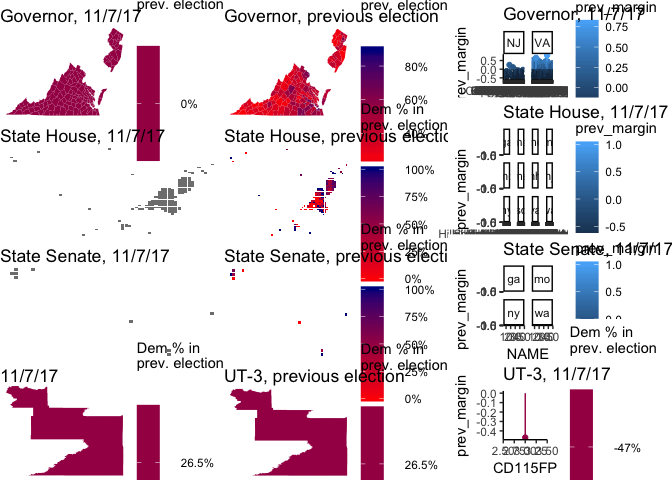

``` r
grid.arrange(gov_gg_new, gov_gg, gov_bar, sh_gg_new, sh_gg, sh_bar, ss_gg_new, ss_gg, ss_bar, house_gg_new, house_gg, house_bar, ncol = 3)
```

    ## Warning: Removed 154 rows containing missing values (geom_point).

    ## Warning: Removed 154 rows containing missing values (geom_segment).

    ## Warning: Removed 165 rows containing missing values (geom_point).

    ## Warning: Removed 165 rows containing missing values (geom_segment).

    ## Warning: Removed 9 rows containing missing values (geom_point).

    ## Warning: Removed 9 rows containing missing values (geom_segment).

    ## Warning: Removed 1 rows containing missing values (geom_point).

    ## Warning: Removed 1 rows containing missing values (geom_segment).


