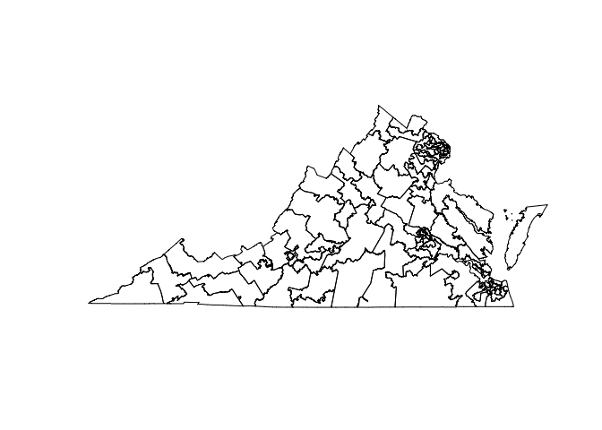
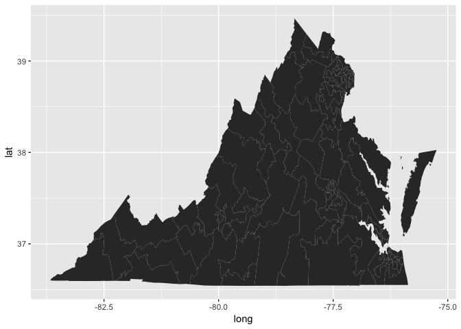

In this post, I introduce the reader to a seven-part `R` tutorial on various topics of importance to practitioners of data science. I start by discussing the overall purpose of the project, the structure of spatial data, and the basics of how to manage spatial data in `R`.

### Part 0: Introduction to the project

In this post, I introduce the reader to a seven-part `R` tutorial designed to take users who are familiar with the very basics of `R` to the intermediate level on some subjects, and the advanced level on others. Specifically, the user will become an advanced organizer and visualizer of data, and an intermediate manipulater of spatial data and accessor of data from a remote resource (or webscraper). I've been thinking of ways to make a full data course out of one big R project, and the recent [special election in Virginia](https://ballotpedia.org/Virginia_state_legislative_special_elections,_2017) provided such a way. On the day of the election I set up a [dedicated page](https://johnlray.github.io/2017/11/07/election_tracker.html) to gather, format, and plot the results of the election as vote tallies rolled in from the various voting sites across the state. The final version of this project required running one `R` script and committing the subsequent changes to git to update a large dataset gathered from the web, store and parse it efficiently, generate plots from that data, and then post those plots to a page. This allowed me to visualize election outcomes live. In this series of posts, I will approximately recreate that project step by step, with the intention of teaching users special topics in `R`.

This tutorial series will involve creating such a project from scratch. I have structured the project as a series of lessons in "special topics," loosely defined as the sort of topic any practiioner of data science should know but not necessarily one taught in introductory-level data science courses. This is not an exhaustive list of such subjects, but includes the most important special topics and the ones necessary to be conversant in political data. Those topics are:

1.  Using R as a GIS
2.  The use of the grammar of graphics with the `ggplot2` library
3.  Acquiring unruly data from a public resource (webscraping)
4.  Managing unruly data
5.  Deploying data visualizations and analysis to the web
6.  Conducting statistical analysis on-the-fly
7.  Putting together the final product with more efficient code

Thus, this post is the first in a series that will have six discrete lessons, and then a seventh to put it all together. The seventh post will also retcon the previous posts to suggest useful ways to tidy up and comment on code for future use and reuse. In the tutorials I will prioritize code that is legible to the novice user, and then in the seventh episode we will rewrite that code to follow good tidyverse practices.

My goal with seven lessons is to have a more or less finished product that can take the user from being a novice to being very good with `R`, with data principles not unique to `R`, and with political data in the United States. The order of events may seem somewhat strange - ggplot before data storage? - but this series revolves around a real-life project I worked on and, if I could do it over again, this is the order in which I would have assembled the project.

To tie each lesson into the final product, here is how we are going to fit each of these lessons together:

-   First, we are going to visualize the geography whose elections we want to track - in this case, Virginia in the 2017 statewide election
-   Then, we are going to tinker with our visualization so that it displays our data in an appealing and informative fashion
-   We will get some real data from the Virginia Department of Elections to add to our visualizations...
-   ...then we will learn how to store that data and format it so its easy to work with
-   With our visualizations complete, we will learn how to deploy them to the web using git and my preferred blogging venue, which is .io with a Jekyll framework
-   While this is not a statistical methods project, but a programming project, we will talk through some simple statistical analysis you can conduct in real-ish time
-   Finally, we will discuss the full workflow to think about how to optimize our production pipeline

I proceed on the following assumptions:

1.  You have `R` and `RStudio` installed on your machine.
2.  You are conversant in basic `R` syntax, about what one would know by the end of the excellent [Quick-R tutorials](https://www.statmethods.net/).

That's about it. Let's get started!

### Part 1: R as a GIS

For this project, we will be plotting legislative districts in the US state of Virginia as a means of visualizing election outcomes as vote tallies roll in. In this lesson, we will retrieve spatial data representing these districts from a public resource, load that data into `R`, and plot that data within our RStudio session.

Geographic Information Systems (GIS) is a term that refers generically to any system or program that helps humans interpret and analyze spatial data. `R` was not designed with GIS in mind but by now there are many libraries and approaches to using `R` as a GIS. I present the easiest and most popular way, under the suspicion that the other ways probably won't be updated so much in the future now that there is a clear favorite among practitioners.

Across operating systems, there are some small differences in the way `R` interprets the arguments you will pass to the function we will use to load the shapefile, which is `readOGR()` from the `rgdal` library. Specifically, the value you pass to the "dsn" (data source name) argument, which is the first argument the function takes, will very likely have to include the full, "literal" filepath to your shapefile rather than the cozy, shorthand version familiar to unix users. For example, on my machine, the phrase "~/Downloads" is the shorthand version of "users/johnray/Downloads." Most likely, when using `readOGR()` on your machine, you will have to use the long version of the filepath rather than the shorthand. We'll work through an example in a minute, but first lets get the data and understand what we're looking at.

While the character and quality of American Federalism is such that there is [some disagreement over who lives in what state legislative district](https://wtop.com/virginia/2017/11/147-voted-wrong-house-delegates-race-va/), the US Census maintains the most up-to-date spatial data on legislative districts in the United States [here](https://www.census.gov/geo/maps-data/data/cbf/cbf_sld.html). For this project, we will be using the spatial data representing Virginia's lower house, called the Virginia House of Delegates, which lives [here](http://www2.census.gov/geo/tiger/GENZ2016/shp/cb_2016_51_sldu_500k.zip). While I typically prefer the fairly friendly point-and-click interface of the Census website to get my data, you can replicate the process of downloading Census shapefiles by running the following code.

``` r
download.file('http://www2.census.gov/geo/tiger/GENZ2016/shp/cb_2016_51_sldl_500k.zip', '~/Downloads/cb_2016_51_sldl_500k.zip')
unzip('~/Downloads/cb_2016_51_sldl_500k.zip', exdir = '~/Downloads/cb_2016_51_sldl_500k')
```

Note that there is some redundancy in my code because I do not use the `setwd()` convention. Also note that I download the spatial data to my machine's "Downloads" folder. Ultimately, you'll want to store this data in a dedicated project folder. For historical political and Census data in the United States, the user should also be aware of the excellent [NHGIS](https://www.nhgis.org/) resource. We will not be using that site for this project, its just a site I like.

Once you have downloaded the .zip file in the above code snippet, I encourage you to go find the unzipped folder on your machine.


Open the cb\_2016\_51\_sldl\_500k folder, and let's have a look at its contents. The Census shapefile naming convention may look like gobbledygoop, but the string "cb\_2016\_51\_sldl\_500k" tells us everything we need to know about the spatial data in the .zip file: We have downloaded a **c**artographic **b**oundary from **2016** covering Virginia's (state FIPS code **51**) **s**tate **l**egislative **d**istricts (**l**ower) at a **500k** resolution, which is fairly coarse by Census standards (i.e., the file will be a manageably small size!). Voici **cb\_2016\_51\_sldl\_500k**.

If this is your first time working with a shapefile, you'll notice you've downloaded a .zip file containing not just one but several files, all with the same name but a different file extension. As with the [Boschian Hellscape](https://upload.wikimedia.org/wikipedia/commons/1/1d/Bosch_-_Haywain_Triptych.jpg) that is LaTeX's file structure, shapefiles are composed of many disparate pieces some of which do not serve an immediately obvious function. Census data is of very high quality and so contains constituent parts many shapefile providers do not bother to include, as only a few of the files here are strictly essential to plotting spatial data. An in-depth knowledge of this system is not necessary, but while we're here, I will hastily review what each file in the `cb_2016_51_sldl_500k` directory contains.

-   **.cpg** contains the character set to use when rendering data contained in the shapefile. As with much of the rest of the universe, our data will be rendered in the UTF-8 character set.

``` r
readLines('~/Downloads/cb_2016_51_sldl_500k/cb_2016_51_sldl_500k.cpg')
```

    ## [1] "UTF-8"

-   **.dbf** contains the tabular data associated with the shapefile.

``` r
library(dplyr, quietly = T, warn.conflicts = F)
library(foreign)

read.dbf('~/Downloads/cb_2016_51_sldl_500k/cb_2016_51_sldl_500k.dbf') %>% head()
```

    ##   STATEFP SLDLST       AFFGEOID GEOID NAME LSAD  LSY      ALAND    AWATER
    ## 1      51    061 620L500US51061 51061   61   LL 2016 5004053111 159231775
    ## 2      51    014 620L500US51014 51014   14   LL 2016 1030436974   6565673
    ## 3      51    026 620L500US51026 51026   26   LL 2016 1186298583   2747407
    ## 4      51    093 620L500US51093 51093   93   LL 2016  179263937  53284336
    ## 5      51    007 620L500US51007 51007    7   LL 2016 2127798575  26726910
    ## 6      51    051 620L500US51051 51051   51   LL 2016  239677590   5468652

-   **.prj** contains the projection method used to generate the vectors comprising the map we will plot. The Census uses NAD83 (North American Declination), while Google and other common providers of spatial data use WGS84 (World Geodetic System) or a similar system.

``` r
readLines('~/Downloads/cb_2016_51_sldl_500k/cb_2016_51_sldl_500k.prj')
```

    ## [1] "GEOGCS[\"GCS_North_American_1983\",DATUM[\"D_North_American_1983\",SPHEROID[\"GRS_1980\",6378137,298.257222101]],PRIMEM[\"Greenwich\",0],UNIT[\"Degree\",0.017453292519943295]]"

-   **.shp** is generally regarded as "the shapefile" itself, as it contains all the vector data a GIS would need to draw a plot.

-   **.xml** contains metadata on the shapefile itself, rather than on the political boundaries the shapefile describes. The .xml metadata is used to populate the Census site describing the shapefile's contents to users, and describes the contents of each of the fields in the shapefile's `.dbf`. The .xml file here is "non-standard" in that its format is not derived literally from the shapefile, but rather from how its curator stores the shapefile on their end.

-   **.shx** is a compiled **.shp**, which kind of makes you wonder what **.shp** is still doing here. What a world!

Note that most GISs need only a .shp (lines) and .dbf (data) to draw an informative spatial plot. The .prj is helpful for telling your GIS what shape you assume the globe to be before drawing on it, but it is not strictly necessary. Further note that each of the .xml files contained in this shapefile are for metadata not actually used by your GIS, but for convenient storage, retrieval, and identification of the shapefile by other systems.

If you feel like it, open the .dbf file associated with this Shapefile using a spreadsheet program of your choice (all the most common spreadsheet programs should be able to open a .dbf file, subject to a few import options to be set by the user upon opening). That file contains the tabular data that will show up in the `@data` slot of the shapefile object once we load it into `R`. Shapefile .dbfs have the curious property that, once encoded as spatial data, the column names in the .dbf contain descriptive information on the contents of the column. For example, the column named `SLDLST` contains a comma and then a 'C' denoting that the column contains character strings, and a number following the 'C' setting the maximum number of characters an individual row may contain. Others have an 'N' or 'I' for numeric or integer information, followed by a number describing how many decimal places a row may contain.

One may reflect on the fact this means we can easily break a shapefile by fiddling with it in a spreadsheet program. If I were to violate the maximum number of characters permitted in a row, the file would cease to save and load properly. Additionally, if I were to add a new row of data, that data would exist in the .dbf but would not have any vector data associated with it, and thus would not plot properly once loaded into a GIS.

**Thus, it is generally unwise to fiddle with a shapefile in anything other than a GIS.** Editing data manually in a spreadsheet is a convenient (and, frankly, underrated) means of making quick changes, but is ill-advised given the peculiar nature of shapefiles. GIS programs usually constrain data edits to avoid creating problems. `R` does not, but code can be rewritten and undone seamlessly enough that we take on less risk by using `R` to edit data rather than a spreadsheet program. Lets close the spreadsheet and count on not opening it again for this unit.

Instead, lets read the shapefile into `R`. To do so we will use the `readOGR()` function from the `rgdal` library, which you should install by running `install.packages('rgdal')`. We will point the function to the location of the shapefile. Your machine uses its own particular set of drivers to interact with shapefiles, and so it is possible that the code I run (on a Mac running El Capitan 10.11.6) to load the file will have to be modified slightly for your machine. Specifically, you may have to fiddle with the filepaths: As mentioned, some operating systems support tilde expansion while others do not, and Windows machines typically use a different file structure than Mac machines.

``` r
library(rgdal, quietly = T, warn.conflicts = F)
```

    ## Warning: package 'rgdal' was built under R version 3.4.1

    ## Warning: package 'sp' was built under R version 3.4.1

    ## rgdal: version: 1.2-8, (SVN revision 663)
    ##  Geospatial Data Abstraction Library extensions to R successfully loaded
    ##  Loaded GDAL runtime: GDAL 2.1.3, released 2017/20/01
    ##  Path to GDAL shared files: /Library/Frameworks/R.framework/Versions/3.4/Resources/library/rgdal/gdal
    ##  Loaded PROJ.4 runtime: Rel. 4.9.3, 15 August 2016, [PJ_VERSION: 493]
    ##  Path to PROJ.4 shared files: /Library/Frameworks/R.framework/Versions/3.4/Resources/library/rgdal/proj
    ##  Linking to sp version: 1.2-4

``` r
shp = readOGR('/Users/johnray/Downloads/cb_2016_51_sldl_500k/', layer = 'cb_2016_51_sldl_500k')
```

    ## OGR data source with driver: ESRI Shapefile 
    ## Source: "/Users/johnray/Downloads/cb_2016_51_sldl_500k/", layer: "cb_2016_51_sldl_500k"
    ## with 100 features
    ## It has 9 fields
    ## Integer64 fields read as strings:  ALAND AWATER

Note that upon loading the shapefile, the output from `readOGR()` tells me that my operating system is running the ESRI Shpaefile driver to load the shapefile, which may be different from the driver installed on your machine. Some Google-fu may be necessary to check your own machine's shapefile driver.

`R` represents the various pieces of a shapefile as slots of one object, here one that I have named `shp`. Just as variables in a dataframe are accessed using the `$` operator, object slots are accessed using the `@` operator. If you chose to name your shapefile `shp` as I did, you can type `shp@` in your console and your RStudio's auto-complete functionality will show you that the slots in this object include `data`, `polygons`, `plotOrder`, `bbox`, and `proj4string`. It probably does not take much imagination to realize those correspond to some of the pieces of the shapefile I discussed previously. Note, for example, that we can find the coordinate projection system by accessing the `@proj4string` object.

``` r
shp@proj4string
```

    ## CRS arguments:
    ##  +proj=longlat +datum=NAD83 +no_defs +ellps=GRS80 +towgs84=0,0,0

Most importantly for our purposes, we can access the data associated with our shapefile by accessing the `@data` object. Unless you are using R for some creative worldbuilding exercise, you are almost never editing any part of a shapefile except for the `data` slot. You will occasionally have to convert the `proj4string` to plot multiple shapefiles that were drawn using different coordinate reference systems, but otherwise, you should basically never edit anything in a shapefile besides `data`.

``` r
shp@data %>% head()
```

    ##   STATEFP SLDLST       AFFGEOID GEOID NAME LSAD  LSY      ALAND    AWATER
    ## 0      51    061 620L500US51061 51061   61   LL 2016 5004053111 159231775
    ## 1      51    014 620L500US51014 51014   14   LL 2016 1030436974   6565673
    ## 2      51    026 620L500US51026 51026   26   LL 2016 1186298583   2747407
    ## 3      51    093 620L500US51093 51093   93   LL 2016  179263937  53284336
    ## 4      51    007 620L500US51007 51007    7   LL 2016 2127798575  26726910
    ## 5      51    051 620L500US51051 51051   51   LL 2016  239677590   5468652

In part two of this project we will work on merging in some new data to this dataframe, but you already have a general sense of how that will proceed, now that we know the data in this shapefile lives in an ordinary dataframe object. As we will see, while adding *rows* to a spatial dataframe is a major no-no as it changes the implied number of polygons in the object, adding *columns* is as trivial as conducting data joins in any other context.

In the beginning of this post I said I'd use this time to explore R as a GIS. Technically, we have accomplished that, as a GIS is just any program that can interpret spatial data. I also find that, for many spatial analysis tasks, users find getting started to be the most difficult part. I, for one, recall being baffled why `readOGR()` was so unhappy with the type of file I was trying to load. It would be unsatisfying to stop here, of course, so lets conclude with the basics of plotting spatial data.

If your shapefile is in the format of a `SpatialPolygonsDataFrame` or `SpatialPointsDataFrame` then creating a simple plot is as easy as a call to `plot()` with the name of the object passed to the first argument. You don't even have to tell the function which values represent the `x` and `y` coordinates!

``` r
plot(shp)
```



You may have worked with the `plot()` function previously and as such it may make your brain a little itchy to use `plot()` without explicitly passing arguments to `x` and `y`. It is not necessary to do so because all objects of the `SpatialPolygons` and `SpatialPoints` classes include a plot *method*, meaning as long as the `plot()` function gets a `SpatialPolygons` or `SpatialPoints` object, the function knows which part of the object to use to draw the plot. (In fact, no values are explicitly passed to the `y` argument in this process, but I invite the reader to tumble down that rabbit hole on their own time)

It is not presently the vogue to use the base `plot` library for data visualization in `R`. I am of the far-from-unanimous view among data science practitioners that `ggplot` syntax is both enjoyable and sensible. Many people do not like it at first. To preface the next episode, we will write some minimal `ggplot` code to demonstrate plotting a shapefile using the go-to graphics library of `R`. If you have not done so already, run `install.packages('ggplot2')` to install the `ggplot2` plotting library.

We will cover the design philosophy of the grammar of graphics in the next unit, but briefly, `ggplot()` plots *layers* containing *geometries* typically defined by variables within a *dataframe*. Precisely as you pass an `x` and a `y` value to their respective arguments for the `plot()` function, you will pass arguments for `x` and `y` to `ggplot()` within its `mapping` argument. Those arguments are by default passed off to yet *another* function, *aes()*. Yikes! To simplify, building a `ggplot()` object traditionally involves passing off a dataframe and then variables within that dataframe, to define the types of geometries you will use to create your visualization.

The shapefile I have chosen for this introductory project is a `SpatialPolygonsDataFrame` meaning that the individual unit of the geometry I will be plotting is a polygon, which for our puroses is a shape defined by x-y coordinate pairs connected by straight lines. In other words, I will be telling R to draw the plot by playing connect-the-dots! If the data you have chosen for your project is of the other most common shapefile type, `SpatialPointsDataFrame`, you will be able to tell `ggplot()` to create either a polygon geometry or a point geometry. Either should work. A `SpatialPointsDataFrame` is for data traditionally represented as points, and a `SpatialPolygonsDataFrame` is for data traditionally represented as shapes.

In brief, all the information we need to create a plot is thus:

-   Our **data**, the shapefile which I have loaded as `shp`
-   Our **aesthetics**, which will include `x`, `y` and, if you are plotting a `SpatialPolygonsDataFrame`, a `group` aesthetic which will ensure `ggplot()` knows which sets of coordinates form the closed loops of a polygon, i.e., will know which dots to connect to which other dots
-   Our **geometry**, the visual representation of our data, which in this case will be 'geom\_polygon\`, the polygon geometry

``` r
library(ggplot2)

ggplot(shp, aes(x = long, y = lat, group = group)) +
  geom_polygon()
```

    ## Regions defined for each Polygons



Hang on a second! A lot just happened! How did `ggplot` accept references to variables called `long` and `lat` even though our dataframe does not contain such variables? What is `group` doing there? Each of these are properties unique to plotting `SpatialDataFrames`, are not widely transferrable across visualization strategies, and are also relatively recent innovations that may change again in near `rgdal` or `ggplot2` iterations. Most importantly, these conventions don't really play back into any longstanding best practices for `ggplot()` and instead are conveniences specific to shapefiles. As such, I do not dwell on them here, and we'll only briefly touch on them again in the next lesson.

In this lesson, I explained the conventional structure of a shapefile, which is a common structure for geospatial data. Most importantly, we learned that shapefiles contain dataframes akin to more traditional datasets, and in the next unit we will use that information to build more fluency with the `ggplot()` function. In the next section, we will merge some electoral data to our shapefile and then use that electoral data to build a better data visualization, one that is prepared for web deployment.

Don't forget to subscribe to this page, [follow me](https://twitter.com/johnlray) for updates, and share this tutorial with friends if you found it useful. On to part two!
