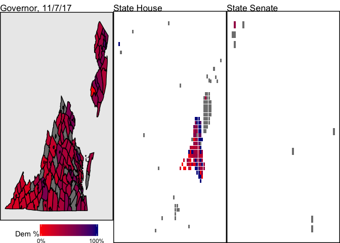
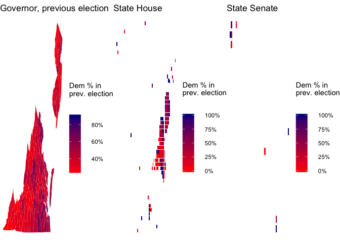
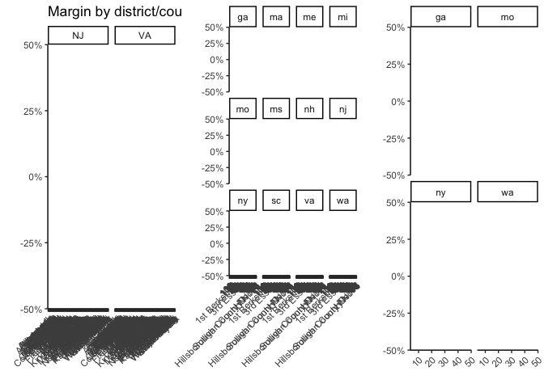
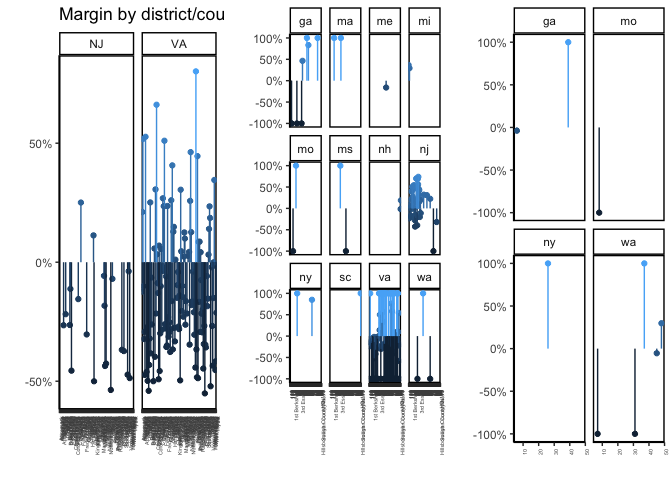

On this page, I am tracking election results for the State House, State Senate/State Assembly, Governor, and Congressional races going on today.

### Tonight's results

The races I will be watching tonight include

-   Virginia governorship and State House
-   New Jersey governorship and General Assembly
-   Georgia State House 4, 26, 42, 56, 60, 89, 117, and 119
-   Georgia State Senate 6 and 39
-   Maine State House 56
-   Massachusetts 1st Berkshire and 3rd Essex (State House)
-   Michigan State House 1 and 109
-   Missouri State House 23 and 151
-   Missouri State Senate 8
-   New Hampshire Hillsborough 15 (State House)
-   New York State Assembly 27 and 71
-   New York State Senate 26
-   South Carolina State House 113
-   Washington State House 7, 31, and 48
-   Washington State Senate 7, 37, 45, and 48

The first column of plots include the Governors' races. The second column of plots includes the lower house races, with lower house seats across the US drawn as equally-sized pixels. The third column includes upper house races.

I will be tracking, but not plotting, the Utah 3rd Congressional district race as well. I could not devise an optimal visual display that included UT-3, but I will note the results.

### Results from these districts' previous elections

### Tonight's Dem - Rep margins

### These districts' previous Dem - Rep margins

Here is the data that goes into these graphs.

| State | County           |  Previous margin|  Tonights margin|
|:------|:-----------------|----------------:|----------------:|
| NJ    | Atlantic         |       -0.2648852|        0.5320826|
| NJ    | Bergen           |       -0.2183007|        0.6116496|
| NJ    | Burlington       |       -0.2636683|        0.5460674|
| NJ    | Camden           |       -0.1119725|        0.6845115|
| NJ    | Cape May         |       -0.4557209|        0.4568586|
| NJ    | Cumberland       |       -0.1549305|        0.5319626|
| NJ    | Essex            |        0.2507773|        0.8050270|
| NJ    | Gloucester       |       -0.3034749|        0.5655615|
| NJ    | Hudson           |        0.1127531|        0.8826369|
| NJ    | Hunterdon        |       -0.5002038|        0.3982921|
| NJ    | Mercer           |       -0.0571603|        0.6460747|
| NJ    | Middlesex        |       -0.1826890|        0.5912997|
| NJ    | Monmouth         |       -0.4359664|        0.4372328|
| NJ    | Morris           |       -0.4258031|        0.4605722|
| NJ    | Ocean            |       -0.5366225|        0.3647482|
| NJ    | Passaic          |       -0.0698529|        0.6489964|
| NJ    | Salem            |       -0.3680313|        0.0000000|
| NJ    | Somerset         |       -0.3733439|        0.5143820|
| NJ    | Sussex           |       -0.4724105|        0.3733953|
| NJ    | Union            |       -0.0380879|        0.6677458|
| NJ    | Warren           |       -0.4867667|        0.3277195|
| VA    | Accomack         |       -0.1235463|        0.4307691|
| VA    | Albemarle        |        0.2108627|        0.5596912|
| VA    | Alexandria       |        0.5175562|        0.8024996|
| VA    | Alleghany        |       -0.1008009|        0.1975296|
| VA    | Amelia           |       -0.3227031|        0.3194812|
| VA    | Amherst          |       -0.2923513|        0.3577788|
| VA    | Appomattox       |       -0.4737065|        0.2339233|
| VA    | Arlington        |        0.5269408|        0.7996698|
| VA    | Augusta          |       -0.4608025|        0.2624025|
| VA    | Bath             |       -0.2727273|               NA|
| VA    | Bedford          |       -0.4983573|        0.2497490|
| VA    | Bland            |       -0.5402844|               NA|
| VA    | Botetourt        |       -0.4316812|        0.2585427|
| VA    | Bristol          |       -0.3204895|        0.3221104|
| VA    | Brunswick        |        0.2512726|        0.5648360|
| VA    | Buchanan         |       -0.3830236|        0.2354245|
| VA    | Buckingham       |       -0.0645579|        0.4191846|
| VA    | Buena Vista      |       -0.2615923|               NA|
| VA    | Campbell         |       -0.4998990|               NA|
| VA    | Caroline         |        0.0577084|        0.3602159|
| VA    | Carroll          |       -0.3974872|        0.2259471|
| VA    | Charles City     |        0.3059514|        0.6295381|
| VA    | Charlotte        |       -0.2154824|               NA|
| VA    | Charlottesville  |        0.6616793|               NA|
| VA    | Chesapeake       |        0.0332200|        0.4559137|
| VA    | Chesterfield     |       -0.0877749|        0.4939834|
| VA    | Clarke           |       -0.1291866|               NA|
| VA    | Colonial Heights |       -0.4916854|        0.2008028|
| VA    | Covington        |        0.0698096|        0.4100825|
| VA    | Craig            |       -0.4571624|               NA|
| VA    | Culpeper         |       -0.2991514|               NA|
| VA    | Cumberland       |       -0.1005291|        0.3373979|
| VA    | Danville         |        0.0553216|        0.5863867|
| VA    | Dickenson        |       -0.2843759|        0.3132528|
| VA    | Dinwiddie        |       -0.0184405|        0.4091061|
| VA    | Emporia          |        0.2686375|        0.5411975|
| VA    | Essex            |       -0.0369596|        0.4687075|
| VA    | Fairfax          |        0.2351716|        0.6320499|
| VA    | Fairfax          |        0.2351716|        0.6320499|
| VA    | Falls Church     |        0.5103966|        0.7796230|
| VA    | Fauquier         |       -0.2602176|        0.3939228|
| VA    | Floyd            |       -0.2783705|        0.3478873|
| VA    | Fluvanna         |       -0.0598147|        0.4634878|
| VA    | Franklin         |       -0.3558610|        0.6152885|
| VA    | Franklin         |       -0.3558610|        0.3627092|
| VA    | Frederick        |       -0.3494124|               NA|
| VA    | Fredericksburg   |        0.2364410|               NA|
| VA    | Galax            |       -0.2307692|        0.3054516|
| VA    | Giles            |       -0.3128205|        0.4147884|
| VA    | Gloucester       |       -0.2959984|        0.3323293|
| VA    | Goochland        |       -0.2524295|        0.3749400|
| VA    | Grayson          |       -0.3769470|        0.2634133|
| VA    | Greene           |       -0.2819549|        0.3610288|
| VA    | Greensville      |        0.2602339|        0.6029872|
| VA    | Halifax          |       -0.1630446|        0.3800691|
| VA    | Hampton          |        0.4068828|        0.7169751|
| VA    | Hanover          |       -0.3662222|        0.3539463|
| VA    | Harrisonburg     |        0.1284675|               NA|
| VA    | Henrico          |        0.1484027|        0.6128962|
| VA    | Henry            |       -0.2754729|        0.3522601|
| VA    | Highland         |       -0.3325359|        0.3120076|
| VA    | Hopewell         |        0.0107179|               NA|
| VA    | Isle of Wight    |       -0.1496049|        0.4081945|
| VA    | James City       |       -0.0960956|        0.4749932|
| VA    | King and Queen   |       -0.0411095|        0.4768717|
| VA    | King George      |       -0.2703220|        0.3831663|
| VA    | King William     |       -0.2808263|               NA|
| VA    | Lancaster        |       -0.1398989|        0.4467974|
| VA    | Lee              |       -0.4964796|        0.2004725|
| VA    | Lexington        |        0.3045296|        0.9516386|
| VA    | Loudoun          |        0.0460316|        0.5986428|
| VA    | Louisa           |       -0.2055562|        0.3898542|
| VA    | Lunenburg        |       -0.0992908|        0.4048537|
| VA    | Lynchburg        |       -0.1459984|               NA|
| VA    | Madison          |       -0.2288862|        0.4378868|
| VA    | Manassas         |        0.0235939|        0.5758598|
| VA    | Manassas Park    |        0.1251232|        0.6474484|
| VA    | Martinsville     |        0.0995533|               NA|
| VA    | Mathews          |       -0.2625077|        0.3531816|
| VA    | Mecklenburg      |       -0.1635463|        0.4019129|
| VA    | Middlesex        |       -0.2156303|        0.3732278|
| VA    | Montgomery       |        0.0267025|        0.4896029|
| VA    | Nelson           |        0.0432086|               NA|
| VA    | New Kent         |       -0.3461835|               NA|
| VA    | Newport News     |        0.2577718|        0.6349447|
| VA    | Norfolk          |        0.4624787|               NA|
| VA    | Northampton      |        0.1262029|               NA|
| VA    | Northumberland   |       -0.1801839|        0.3768884|
| VA    | Norton           |       -0.1642512|        0.3388426|
| VA    | Nottoway         |       -0.0391245|        0.4293503|
| VA    | Orange           |       -0.2102285|        0.3848075|
| VA    | Page             |       -0.3046047|        0.3127719|
| VA    | Patrick          |       -0.4425497|               NA|
| VA    | Petersburg       |        0.8019360|        0.9016388|
| VA    | Pittsylvania     |       -0.3662359|        0.2955775|
| VA    | Poquoson         |       -0.4834865|               NA|
| VA    | Portsmouth       |        0.4456580|        0.6018234|
| VA    | Powhatan         |       -0.4871625|               NA|
| VA    | Prince Edward    |        0.0856679|        0.5155690|
| VA    | Prince George    |       -0.1665697|               NA|
| VA    | Prince William   |        0.0862477|        0.6090045|
| VA    | Pulaski          |       -0.2929736|        0.2579808|
| VA    | Radford          |        0.0420168|        0.5536939|
| VA    | Rappahannock     |       -0.0749373|        0.4464523|
| VA    | Richmond         |       -0.2153918|        0.8065259|
| VA    | Richmond         |       -0.2153918|        0.8065259|
| VA    | Roanoke          |       -0.2939320|        0.6798043|
| VA    | Roanoke          |       -0.2939320|        0.6798043|
| VA    | Rockbridge       |       -0.1991435|        0.3663422|
| VA    | Rockingham       |       -0.4466728|               NA|
| VA    | Russell          |       -0.3438464|        0.2363910|
| VA    | Salem            |       -0.2672237|               NA|
| VA    | Scott            |       -0.5510758|        0.1772194|
| VA    | Shenandoah       |       -0.3464711|        0.3254259|
| VA    | Smyth            |       -0.3580075|        0.2138849|
| VA    | Southampton      |       -0.0580751|               NA|
| VA    | Spotsylvania     |       -0.1846539|        0.4326218|
| VA    | Stafford         |       -0.1531068|               NA|
| VA    | Staunton         |        0.0318880|        0.5461469|
| VA    | Suffolk          |        0.1400295|        0.5467077|
| VA    | Surry            |        0.2346259|        0.5399585|
| VA    | Sussex           |        0.1859037|               NA|
| VA    | Tazewell         |       -0.5211210|        0.1532888|
| VA    | Virginia Beach   |       -0.0211897|        0.5175531|
| VA    | Warren           |       -0.2677820|        0.3479868|
| VA    | Washington       |       -0.4346858|        0.2521688|
| VA    | Waynesboro       |       -0.1505757|        0.4576358|
| VA    | Westmoreland     |       -0.0002364|               NA|
| VA    | Williamsburg     |        0.3454100|        0.7143130|
| VA    | Winchester       |       -0.0133133|               NA|
| VA    | Wise             |       -0.4527785|        0.2147601|
| VA    | Wythe            |       -0.4159065|        0.2880511|
| VA    | York             |       -0.2124263|        0.4421649|

| State |  County|  Previous margin|  Tonights margin|
|:------|-------:|----------------:|----------------:|
| ga    |      39|           1.0000|               NA|
| ga    |       6|          -0.0384|               NA|
| mo    |       8|          -1.0000|               NA|
| ny    |      26|           1.0000|               NA|
| wa    |      31|          -1.0000|               NA|
| wa    |      45|          -0.0540|               NA|
| wa    |       7|          -1.0000|               NA|
| wa    |      48|           0.2980|         0.999001|
| wa    |      37|           1.0000|               NA|

| State | County                     |  Previous margin|  Tonights margin|
|:------|:---------------------------|----------------:|----------------:|
| ga    | 4                          |       -1.0000000|               NA|
| ga    | 26                         |       -1.0000000|               NA|
| ga    | 42                         |        0.4650000|               NA|
| ga    | 56                         |        1.0000000|               NA|
| ga    | 60                         |        0.8328000|               NA|
| ga    | 89                         |        1.0000000|               NA|
| ga    | 117                        |       -1.0000000|               NA|
| ga    | 119                        |       -1.0000000|               NA|
| me    | 56                         |       -0.1602000|               NA|
| ma    | 1st Berkshire              |        1.0000000|               NA|
| ma    | 3rd Essex                  |        1.0000000|               NA|
| mi    | 1                          |        0.3668000|               NA|
| mi    | 109                        |        0.2925239|               NA|
| ms    | 38                         |        1.0000000|               NA|
| ms    | 54                         |       -1.0000000|               NA|
| mo    | 23                         |        1.0000000|               NA|
| mo    | 151                        |       -1.0000000|               NA|
| nh    | Hillsborough County No. 15 |       -0.0150000|               NA|
| nh    | Sullivan County No. 1      |        0.1876000|               NA|
| nj    | 1                          |        0.0848396|        0.5999940|
| nj    | 2                          |       -0.0021515|        0.5499945|
| nj    | 3                          |        0.1301350|        0.6199938|
| nj    | 4                          |        0.2072082|        0.6299937|
| nj    | 5                          |        0.3203447|        0.6599934|
| nj    | 6                          |        0.3090405|        0.6999930|
| nj    | 7                          |        0.2250810|        0.6299937|
| nj    | 8                          |       -1.0000000|        0.4999950|
| nj    | 9                          |       -0.3185277|        0.3399966|
| nj    | 10                         |       -0.2347365|        0.3299967|
| nj    | 11                         |        0.0166424|        0.5499945|
| nj    | 12                         |       -0.1711844|        0.4099959|
| nj    | 13                         |       -0.2029325|        0.4399956|
| nj    | 14                         |        0.2098947|        0.5999940|
| nj    | 15                         |        0.3982857|        0.7199928|
| nj    | 16                         |       -0.0069984|        0.5599944|
| nj    | 17                         |        0.5069261|        0.7099929|
| nj    | 18                         |        0.2712670|        0.6299937|
| nj    | 19                         |        0.4382744|        0.7099929|
| nj    | 20                         |        0.5433703|        0.8999910|
| nj    | 21                         |       -0.1884638|        0.4799952|
| nj    | 22                         |        0.2049093|        0.6599934|
| nj    | 23                         |       -0.2733773|        0.3999960|
| nj    | 24                         |       -0.4270399|        0.3899961|
| nj    | 25                         |       -0.1527491|        0.4799952|
| nj    | 26                         |       -0.2252152|        0.4599954|
| nj    | 27                         |        0.1602139|        0.6699933|
| nj    | 28                         |        0.6994319|        0.8299917|
| nj    | 29                         |        0.6925360|        0.8199918|
| nj    | 30                         |       -0.3955595|        0.3499965|
| nj    | 31                         |        0.4878184|        0.8099919|
| nj    | 32                         |        0.6889466|        0.8099919|
| nj    | 33                         |        0.5621226|        0.9299907|
| nj    | 34                         |        0.7382539|        0.9399906|
| nj    | 35                         |        0.4578129|        0.6399936|
| nj    | 36                         |        0.3218878|        0.5999940|
| nj    | 37                         |        0.4335451|        0.7399926|
| nj    | 38                         |        0.1640599|        0.5999940|
| nj    | 39                         |       -0.2010918|        0.4499955|
| nj    | 40                         |       -0.1114845|        0.4699953|
| ny    | 27                         |        1.0000000|               NA|
| ny    | 71                         |        0.8494000|               NA|
| sc    | HD-113                     |        1.0000000|               NA|
| va    | 1                          |       -1.0000000|        0.2176395|
| va    | 2                          |       -0.0200000|        0.7805985|
| va    | 3                          |       -1.0000000|        0.2219124|
| va    | 4                          |       -1.0000000|        0.0000000|
| va    | 5                          |       -1.0000000|        0.0000000|
| va    | 6                          |       -1.0000000|        0.0000000|
| va    | 7                          |       -1.0000000|        0.2698972|
| va    | 8                          |       -1.0000000|        0.3966244|
| va    | 9                          |       -1.0000000|        0.3805013|
| va    | 10                         |       -0.2400000|        0.5773999|
| va    | 11                         |        1.0000000|        0.9990010|
| va    | 12                         |       -0.1600000|        0.5495812|
| va    | 13                         |       -0.1200000|        0.5344846|
| va    | 14                         |       -1.0000000|        0.0000000|
| va    | 15                         |       -1.0000000|        0.0000000|
| va    | 16                         |       -1.0000000|        0.0000000|
| va    | 17                         |       -1.0000000|        0.3079663|
| va    | 18                         |       -1.0000000|        0.3816126|
| va    | 19                         |       -1.0000000|        0.0000000|
| va    | 20                         |       -0.5200000|        0.4026691|
| va    | 21                         |       -0.1400000|        0.5527668|
| va    | 22                         |       -1.0000000|        0.0000000|
| va    | 23                         |       -1.0000000|        0.2224178|
| va    | 24                         |       -0.4200000|        0.0000000|
| va    | 25                         |       -0.3200000|        0.2543960|
| va    | 26                         |       -1.0000000|               NA|
| va    | 27                         |       -0.1800000|        0.5021084|
| va    | 28                         |       -0.2000000|               NA|
| va    | 29                         |       -1.0000000|        0.3467149|
| va    | 30                         |       -1.0000000|        0.3798161|
| va    | 31                         |       -0.0600000|        0.5477247|
| va    | 32                         |       -0.0600000|        0.5891949|
| va    | 33                         |       -0.2500000|        0.4689659|
| va    | 34                         |        0.0000000|        0.6328261|
| va    | 35                         |        1.0000000|        0.9990010|
| va    | 36                         |        1.0000000|        0.9990010|
| va    | 37                         |        0.1400000|        0.9990010|
| va    | 38                         |        0.5000000|        0.7499996|
| va    | 39                         |        1.0000000|        0.9990010|
| va    | 40                         |       -0.3000000|        0.4403788|
| va    | 41                         |        1.0000000|        0.9990010|
| va    | 42                         |       -0.2600000|               NA|
| va    | 43                         |        0.3094995|        0.9990010|
| va    | 44                         |        1.0000000|        0.9990010|
| va    | 45                         |        1.0000000|        0.9990010|
| va    | 46                         |        0.3430186|        0.9990010|
| va    | 47                         |        0.5600000|        0.9990010|
| va    | 48                         |        1.0000000|        0.9990010|
| va    | 49                         |        1.0000000|        0.8202625|
| va    | 50                         |       -0.1800000|        0.5811848|
| va    | 51                         |       -1.0000000|        0.5200739|
| va    | 52                         |        1.0000000|        0.9990010|
| va    | 53                         |        1.0000000|        0.9990010|
| va    | 54                         |       -1.0000000|        0.4107049|
| va    | 55                         |       -0.2000000|        0.4155523|
| va    | 56                         |       -1.0000000|        0.4297990|
| va    | 57                         |        1.0000000|        0.9990010|
| va    | 58                         |       -1.0000000|        0.3698424|
| va    | 59                         |       -1.0000000|        0.3134422|
| va    | 60                         |       -1.0000000|        0.4788937|
| va    | 61                         |       -0.4200000|        0.0000000|
| va    | 62                         |       -0.2000000|        0.5383739|
| va    | 63                         |        1.0000000|        0.9990010|
| va    | 64                         |       -1.0000000|        0.3791542|
| va    | 65                         |       -1.0000000|        0.4240249|
| va    | 66                         |       -1.0000000|        0.3487503|
| va    | 67                         |       -1.0000000|        0.5510261|
| va    | 68                         |       -0.2478476|        0.4508854|
| va    | 69                         |        1.0000000|        0.9990010|
| va    | 70                         |        1.0000000|        0.9990010|
| va    | 71                         |        0.7600000|        0.9990010|
| va    | 72                         |       -1.0000000|        0.5150476|
| va    | 73                         |       -1.0000000|        0.5040621|
| va    | 74                         |        0.5800000|        0.8306766|
| va    | 75                         |        1.0000000|        0.9990010|
| va    | 76                         |       -1.0000000|        0.0000000|
| va    | 77                         |        1.0000000|        0.9990010|
| va    | 78                         |       -1.0000000|        0.0000000|
| va    | 79                         |        1.0000000|        0.9990010|
| va    | 80                         |        1.0000000|        0.9990010|
| va    | 81                         |       -0.4000000|        0.4043567|
| va    | 82                         |       -0.3000000|        0.3965469|
| va    | 83                         |       -1.0000000|        0.4067795|
| va    | 84                         |       -1.0000000|        0.4439271|
| va    | 85                         |       -1.0000000|        0.4855900|
| va    | 86                         |        0.0897360|        0.6584306|
| va    | 87                         |       -0.0017054|        0.6083929|
| va    | 88                         |       -1.0000000|        0.3182706|
| va    | 89                         |        1.0000000|        0.9990010|
| va    | 90                         |        1.0000000|        0.9990010|
| va    | 91                         |       -1.0000000|        0.4876791|
| va    | 92                         |        1.0000000|        0.9990010|
| va    | 93                         |        0.1000000|        0.5792518|
| va    | 94                         |       -0.1600000|        0.4856172|
| va    | 95                         |        0.5400000|        0.9990010|
| va    | 96                         |       -0.2200000|        0.4143410|
| va    | 97                         |       -0.5800000|        0.3318385|
| va    | 98                         |       -1.0000000|        0.3573883|
| va    | 99                         |       -1.0000000|        0.3803363|
| va    | 100                        |       -0.1400000|        0.2797660|
| wa    | 7                          |       -1.0000000|               NA|
| wa    | 31                         |       -1.0000000|               NA|
| wa    | 48                         |        1.0000000|        0.9990010|
