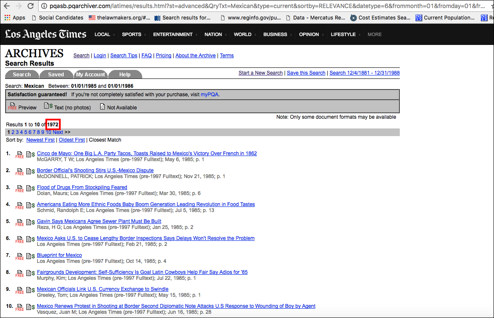

In this post, I will provide a brief tutorial on the most common form of what is commonly known as "web scraping." This form of web scraping involves the following operations:

- Querying a resource (visiting a website) in pursuit of a pre-defined result (the data you want)
- Locating the desired result (your data) in the structure of the resource (the page that gets returned) so that you can process a large volume of queries efficiently
- Formatting the queries' results so they're useful for you as a data practitioner

Typically people think of "web scraping" as that first one and a little of the second one, but this is a mistake. Items two and three on that list usually take longer than the first, yet do not readily come to mind when we think of "web scraping." While practitioners have opted for some reason to refer to this practice as "scraping," all we are really doing is *querying* a website in the hopes of eliciting a *structured response,* or a response that we can structure into a dataset that we can use for our own nefarious purposes. I prefer referring to this practice as "structured querying" rather than "scraping," which reminds me either of what I did to my knees when learning to skateboard as a kid or what I do to a chalkboard when my students aren't paying attention, the memories of neither of which I enjoy dwelling on.

For this example, I will be querying the *Los Angeles Times* archives. I invite you to follow along with your own site of interest. I have not included the url to the resource I'll be working with because sometimes people nice enough to host large quantities of data on the Internet get upset when us dingbat social scientists bash their servers with too many queries. In other words, I leave it to you to follow along with your own project.

In this example, I am interested in just one piece of data, which is a count of the occurrences of an arbitrary search term in an arbitrary date range. In such cases there is often a temptation to simply assemble the desired dataset by hand, rather than to write code. That temptation amounts to lost time and effort because most scraping activities are very similar. Typically, scraping involves structuring a URL to return a page containing a desired result, and then popping that result into a dataframe. While every project is different in the minutia, the broad strokes are the same. As I will show here, the code involved is pretty straightforward and easily modified from project to project.

Here is a screenshot of the front-end of the *Los Angeles Times* archives' website. On that page, users are invited to enter search terms into a box, to select a "content option," how to sort the results, a date range, and some optional article characteristics. What fun! For my present needs I will only be making use of the search box and the date range.

Before proceeding, it is important to stop and make sure you have a clear concept of the final dataset you want to build. Querying a lot of data can take a long time. For this project, I am interested in producing counts of *LA Times* articles containing each of a list of search terms, and I want those counts to be aggregated by year. Thus, I will be manipulating the search box and the date range, and nothing else.

And here is the result when I press the "Search" button with this query.

Paydirt! Specifically, amidst all this data, the one result I want is plainly visible:

And, more importantly, the means of finding this data for lots and lots of query results in a short amount of time is plainly visible as well: The URL structure of the search.

Recall the contents of the search I submitted to start with, and then take a look at the full URL associated with the search: `http://pqasb.pqarchiver.com/latimes/results.html?st=advanced&QryTxt=Mexican&type=current&sortby=RELEVANCE&datetype=6&frommonth=01&fromday=01&fromyear=1985&tomonth=01&today=01&toyear=1986&By=&Title=&at_curr=ALL&Sect=ALL`. Lets stare at it for a minute and see if we can figure out how the resource is translating my manual search to a structured result.

We can clearly see from my masterful rendering in MS Paint that by manipulating the `QryTxt`, `frommonth`, `fromday`, `fromyear`, `tomonth`, `today`, and `toyear` parameters in the URL, we can fully recreate the search I entered manually. Lets try it. Change the URL we entered to something with a new date range and a new `QryTxt` term. If I change the `QryTxt` term to `Brazil,` for example, I see 746 articles written between January 1, 1985 and January 1, 1986 containing the phrase "Brazil" in the *LA Times* archives. In the example I used initially, I saw 3,201 articles containing the phrase "Mexico" written between 1985 and 1986.

This is the first crucial piece of information we will pass to our machines in a programmatic fashion, which our machines will in turn pass to the *LATimes* servers as a request for information, specifically, a web page from which we will cull a piece of data. That piece of data is the second part. That is, we need a way to tell our machines to look for that count of articles that pops up on the search result page.

To do so, we will install a browser add-on called [SelectorGadget](http://selectorgadget.com/), which works on all major browsers. Once you install and activate the extension, you will see a box to activate the add-on on your browser that looks like this:

